# PHP-Generic-Database

<p align="center">
    
</p>

<p align="center">
    
    
</p>

PHP-Generic-Database is a set of PHP classes for connecting, displaying and generically manipulating data from a database, making it possible to centralize or standardize all the most varied types and behaviors of each database in a single format, using the standard Strategy, heavily inspired by [Medoo](https://medoo.in/) and [Dibi](https://dibiphp.com/en/) and [PowerLite](https://www.powerlitepdo.com/).

## Supported Databases

PHP-Generic-Database currently supports the following mechanisms/database:


## Features

- **Lightweight** - Light, simple and minimalist, easy to use and with a low learning curve.
- **Agnostic** - It can be used in different ways, supporting chainable methods, fluent design, dynamic arguments and static array.
- **Easy** - Easy to learn and use, with a friendly construction.
- **Powerful** - Supports various common and complex SQL queries, data mapping and prevents SQL injection.
- **Compatible** - Supports MySQL/MariaDB, SQLSrv/MSSQL, Interbase/Firebird, PgSQL, OCI, SQLite, and more.
- **Auto Escape** - Automatically escape SQL queries according to the driver dialect or SQL engine used.
- **Friendly** - Works well with every PHP framework, such as Laravel, Codeigniter, CakePHP, and frameworks that support singleton extension or composer.
- **Free** - Under the MIT license, you can use it anywhere, for whatever purpose.

## Requirements

- **PHP >= 8.0**
- **Composer**
- **Native Extensions**
  - **MySQL/MariaDB** ***(MySQLi)*** *[php_mysqli.dll/so]*
  - **PostgreSQL** ***(PgSQL)*** *[php_pgsql.dll/so]*
  - **Oracle** ***(OCI8)*** *[php_oci8_***.dll/so]*
  - **SQL Server** ***(sqlsrv)*** *[php_sqlsrv.dll/so]*
  - **Firebird/Interbase** ***(ibase: gds | firebird: fds)*** *[php_interbase.dll/so]*
  - **SQLite** ***(SQLite3)*** *[php_sqlite3.dll/so]*
- **PDO Extensions**
  - **MySQL/MariaDB** ***(MySQL)*** *[php_pdo_mysql.dll/so]*
  - **PostgreSQL** ***(PgSQL)*** *[php_pdo_pgsql.dll/so]*
  - **Oracle** ***(OCI)*** *[php_pdo_oci.dll/so]*
  - **SQL Server** ***(sqlsrv)*** *[php_pdo_sqlsrv.dll/so]*
  - **Firebird/Interbase** ***(ibase: gds | firebird: fds)*** *[php_pdo_firebird.dll/so]*
  - **SQLite** ***(SQLite)*** *[php_pdo_sqlite.dll/so]*
  - **ODBC** ***(ODBC)*** *[php_pdo_obdc.dll/so]*
- **ODBC Externsions**
  - **MySQL/MariaDB** ***(MySQL)*** *[myodbc8a.dll/so]*
  - **PostgreSQL** ***(PgSQL)*** *[psqlodbc30a.dll/so]*
  - **OCI** ***(ORACLE)*** *[sqora32.dll/so]*
  - **SQL Server** ***(sqlsrv)*** *[sqlsrv32.dll/so]*
  - **Firebird/Interbase** ***(ibase: gds | firebird: fds)*** *[odbcFb.dll/so]*
  - **SQLite** ***(SQLite)*** *[sqlite3odbc.dll/so]*
  - **Access** ***(Access)*** *[aceodbc.dll/so]*
  - **Excel** ***(Excel)*** *[aceodexl.dll/so]*
  - **Text** ***(Text)*** *[aceodtxt.dll/so]*
- **Optional External Formats**
  - **INI** ***(php native compilation)***
  - **XML** ***(ext-libxml, ext-xmlreader, ext-simplexml)***
  - **JSON** ***(php native compilation)***
  - **YAML** ***(ext-yaml)***

## PHP Settings

- DLLs Compiled from each database engine for each PHP version.
  - DLL package for [PHP 8.1](./assets/DLL/PHP8.1/PHP8.1.zip) version.
  - DLL package for [PHP 8.2](./assets/DLL/PHP8.2/PHP8.2.zip) version.
- PHP.ini configuration and extension instalation.

## Extension Instalation

1) Edit the php.ini file and remove the &#039;;&#039; for the database extension you want to install.
2) The .dll is for Windows and the .so is for Linux/UNIX.
3) Uncomment the lines of the extensions you want to enable.

- From

```ini
;extension=php_pdo_mysql.dll
;extension=php_pdo_mysql.so
```

- To

```ini
extension=php_pdo_mysql.dll
extension=php_pdo_mysql.so
```

4) Save it, and restart the PHP or Apache Server.
5) If the extension is installed successfully, you can find it on phpinfo() output.

## Manual Installation

1) Make sure Composer is installed, otherwise install from the [official website](https://getcomposer.org/download/).
2) Make sure Git is installed, otherwise install from the [official website](https://git-scm.com/downloads).
3) After Composer and Git are installed, clone this repository with the command line below:

```bash
git clone https://github.com/nicksonjean/PHP-Generic-Database.git
```

4) Then run the following command to install all packages and dependencies for this project:

```bash
composer install
```

5) [Optional] If you need to reinstall, run the following command:

```bash
composer setup
```

## Installation via Docker

1) Make sure Docker Desktop is installed, otherwise install from the [official website](https://www.docker.com/products/docker-desktop/).
2) Create an account to use Docker Desktop/Hub, and be able to clone containers hosted on the Docker network.
3) Once logged in to Docker Hub and with Docker Desktop open on your system, run the command below:

```bash
docker pull php-generic-database:8.3-full
```

or

for Windows:

```bash
.\setup.bat --build-arg PHP_VERSION=8.3 --build-arg PHP_PORT=8300 --run "docker compose up -d"
```

for Linux or Mac:

```bash
.\setup.sh --build-arg PHP_VERSION=8.3 --build-arg PHP_PORT=8300 --run "docker compose up -d"
```

4) Docker will download, install and configure a Debian-Like Linux Custom Image as Apache and with PHP 8.1 with all Extensions properly configured.

## Installation via Composer

1) Make sure Composer is installed, otherwise install from the [official website](https://getcomposer.org/download/).
2) After Composer are installed, clone this repository with the command line below:
3) Add PHP-Generic-Database to the composer.json configuration file.

```bash
composer require nicksonjean/php-generic-database
```

4) And update the composer

```bash
composer update
```

## Documentation

### How to use

Below is a series of readmes containing examples of how to use the lib and a [topology](./assets/topology.png) image of the native drivers and pdo.

- Connection:
  - Strategy:
    - [Chainable.md](./readme/Connection/Strategy/Chainable.md)
    - [Fluent.md](./readme/Connection/Strategy/Fluent.md)
    - [StaticArgs.md](./readme/Connection/Strategy/StaticArgs.md)
    - [StaticArray.md](./readme/Connection/Strategy/StaticArray.md)
  - Modules:
    - [Chainable.md](./readme/Connection/Modules/Chainable.md)
    - [Fluent.md](./readme/Connection/Modules/Fluent.md)
    - [StaticArgs.md](./readme/Connection/Modules/StaticArgs.md)
    - [StaticArray.md](./readme/Connection/Modules/StaticArray.md)
  - Engines:
    - MySQL/MariaDB with mysqli: [MySQLiConnection.md](./readme/Engines/MySQLiConnection.md)
    - Firebird/Interbase with fbird/ibase: [FirebirdConnection.md](./readme/Engines/FirebirdConnection.md)
    - Oracle with oci8: [OCIConnection.md](./readme/Engines/OCIConnection.md)
    - PostgreSQL with pgsql: [PgSQLConnection.md](./readme/Engines/PgSQLConnection.md)
    - SQL Server with sqlsrv: [SQLSrvConnection.md](./readme/Engines/SQLSrvConnection.md)
    - SQLite with sqlite3: [SQLiteConnection.md](./readme/Engines/SQLiteConnection.md)
    - PDO:
      - [Chainable.md](./readme/Engines/PDOConnection/Chainable.md)
      - [Fluent.md](./readme/Engines/PDOConnection/Fluent.md)
      - [StaticArgs.md](./readme/Engines/PDOConnection/StaticArgs.md)
      - [StaticArray.md](./readme/Engines/PDOConnection/StaticArray.md)
    - ODBC:
      - [Chainable.md](./readme/Engines/ODBCConnection/Chainable.md)
      - [Fluent.md](./readme/Engines/ODBCConnection/Fluent.md)
      - [StaticArgs.md](./readme/Engines/ODBCConnection/StaticArgs.md)
      - [StaticArray.md](./readme/Engines/ODBCConnection/StaticArray.md)
  - Statements: [Statements.md](./readme/Statements.md)
  - Fetches: [Fetches.md](./readme/Fetches.md)
- QueryBuilder:
  - Strategy:
    - [StrategyQueryBuilder.md](./readme/QueryBuilder/StrategyQueryBuilder.md)
  - Engines:
    - MySQL/MariaDB with mysqli: [MySQLiQueryBuilder.md](./readme/Engines/MySQLiQueryBuilder.md)
    - Firebird/Interbase with fbird/ibase: [FirebirdQueryBuilder.md](./readme/Engines/FirebirdQueryBuilder.md)
    - Oracle with oci8: [OCIQueryBuilder.md](./readme/Engines/OCIQueryBuilder.md)
    - PostgreSQL with pgsql: [PgSQLQueryBuilder.md](./readme/Engines/PgSQLQueryBuilder.md)
    - SQL Server with sqlsrv: [SQLSrvQueryBuilder.md](./readme/Engines/SQLSrvQueryBuilder.md)
    - SQLite with sqlite3: [SQLiteQueryBuilder.md](./readme/Engines/SQLiteQueryBuilder.md)
    - PDO: [PDOQueryBuilder.md](./readme/Engines/PDOQueryBuilder.md)
    - ODBC: [ODBCQueryBuilder.md](./readme/Engines/ODBCQueryBuilder.md)

## Diagram

The diagram clearly shows the organization of your project, which appears to be a database abstraction library with support for multiple engines (MySQL, PostgreSQL, SQLite, SQL Server, Firebird, OCI, and ODBC), as well as a well-defined structure of abstract classes and interfaces.

```mermaid
graph TD
    Root["Root"]
    
    Root --> Connection["Connection.php"]
    Root --> QueryBuilder["QueryBuilder.php"]
    
    %% Abstract folder
    Root --> Abstract["Abstract/"]
    Abstract --> AbstractArguments["AbstractArguments.php"]
    Abstract --> AbstractAttributes["AbstractAttributes.php"]
    Abstract --> AbstractFetch["AbstractFetch.php"]
    Abstract --> AbstractOptions["AbstractOptions.php"]
    Abstract --> AbstractStatements["AbstractStatements.php"]
    
    %% Core folder
    Root --> Core["Core/"]
    Core --> Build["Build.php"]
    Core --> Column["Column.php"]
    Core --> Condition["Condition.php"]
    Core --> Entity["Entity.php"]
    Core --> Grouping["Grouping.php"]
    Core --> Having["Having.php"]
    Core --> Insert["Insert.php"]
    Core --> Join["Join.php"]
    Core --> Junction["Junction.php"]
    Core --> Limit["Limit.php"]
    Core --> Query["Query.php"]
    Core --> Select["Select.php"]
    Core --> Sorting["Sorting.php"]
    Core --> Table["Table.php"]
    Core --> Types["Types.php"]
    Core --> Where["Where.php"]
    
    Core --> Emulated["Core/Emulated/"]
    Emulated --> EmulatedBuild["Build.php"]
    Emulated --> EmulatedColumn["Column.php"]
    Emulated --> EmulatedCondition["Condition.php"]
    Emulated --> EmulatedEntity["Entity.php"]
    Emulated --> EmulatedGrouping["Grouping.php"]
    Emulated --> EmulatedHaving["Having.php"]
    Emulated --> EmulatedInsert["Insert.php"]
    Emulated --> EmulatedJoin["Join.php"]
    Emulated --> EmulatedJunction["Junction.php"]
    Emulated --> EmulatedLimit["Limit.php"]
    Emulated --> EmulatedQuery["Query.php"]
    Emulated --> EmulatedSelect["Select.php"]
    Emulated --> EmulatedSorting["Sorting.php"]
    Emulated --> EmulatedTable["Table.php"]
    Emulated --> EmulatedTypes["Types.php"]
    Emulated --> EmulatedWhere["Where.php"]
    
    Core --> Native["Core/Native/"]
    Native --> NativeBuild["Build.php"]
    Native --> NativeColumn["Column.php"]
    Native --> NativeCondition["Condition.php"]
    Native --> NativeEntity["Entity.php"]
    Native --> NativeGrouping["Grouping.php"]
    Native --> NativeHaving["Having.php"]
    Native --> NativeInsert["Insert.php"]
    Native --> NativeJoin["Join.php"]
    Native --> NativeJunction["Junction.php"]
    Native --> NativeLimit["Limit.php"]
    Native --> NativeQuery["Query.php"]
    Native --> NativeSelect["Select.php"]
    Native --> NativeSorting["Sorting.php"]
    Native --> NativeTable["Table.php"]
    Native --> NativeTypes["Types.php"]
    Native --> NativeWhere["Where.php"]
    
    %% Engine folder (simplified to main drivers)
    Root --> Engine["Engine/"]
    Engine --> EngineConnections["Connection Files (.php)"]
    Engine --> EngineBuilders["QueryBuilder Files (.php)"]
    
    Engine --> MySQL["Engine/MySQLi/"]
    MySQL --> MySQLConnection["Connection/"]
    MySQL --> MySQLQueryBuilder["QueryBuilder/"]
    
    Engine --> PDO["Engine/PDO/"]
    PDO --> PDOConnection["Connection/"]
    PDO --> PDOQueryBuilder["QueryBuilder/"]
    
    Engine --> PostgreSQL["Engine/PgSQL/"]
    PostgreSQL --> PostgreSQLConnection["Connection/"]
    PostgreSQL --> PostgreSQLQueryBuilder["QueryBuilder/"]
    
    Engine --> SQLite["Engine/SQLite/"]
    SQLite --> SQLiteConnection["Connection/"]
    SQLite --> SQLiteQueryBuilder["QueryBuilder/"]
    
    Engine --> SQLServer["Engine/SQLSrv/"]
    SQLServer --> SQLServerConnection["Connection/"]
    SQLServer --> SQLServerQueryBuilder["QueryBuilder/"]
    
    Engine --> Firebird["Engine/Firebird/"]
    Firebird --> FirebirdConnection["Connection/"]
    Firebird --> FirebirdQueryBuilder["QueryBuilder/"]
    
    Engine --> OCI["Engine/OCI/"]
    OCI --> OCIConnection["Connection/"]
    OCI --> OCIQueryBuilder["QueryBuilder/"]
    
    Engine --> ODBC["Engine/ODBC/"]
    ODBC --> ODBCConnection["Connection/"]
    ODBC --> ODBCQueryBuilder["QueryBuilder/"]
    
    %% Generic folder
    Root --> Generic["Generic/"]
    Generic --> GenericConnection["Connection/"]
    Generic --> GenericFetch["Fetch/"]
    Generic --> GenericStatements["Statements/"]
    
    %% Helpers folder
    Root --> Helpers["Helpers/"]
    Helpers --> Compare["Compare.php"]
    Helpers --> Errors["Errors.php"]
    Helpers --> Exceptions["Exceptions.php"]
    Helpers --> Generators["Generators.php"]
    Helpers --> Hash["Hash.php"]
    Helpers --> Path["Path.php"]
    Helpers --> Reflections["Reflections.php"]
    Helpers --> Schemas["Schemas.php"]
    Helpers --> Validations["Validations.php"]
    
    Helpers --> Parsers["Parsers/"]
    Helpers --> Types["Types/"]
    
    %% Interfaces folder
    Root --> Interfaces["Interfaces/"]
    Interfaces --> IConnection["IConnection.php"]
    Interfaces --> IQueryBuilder["IQueryBuilder.php"]
    Interfaces --> ConnectionInt["Connection/"]
    Interfaces --> QueryBuilderInt["QueryBuilder/"]
    Interfaces --> StrategyInt["Strategy/"]
    
    %% Modules folder
    Root --> Modules["Modules/"]
    Modules --> Chainable["Chainable.php"]
    Modules --> Fluent["Fluent.php"]
    Modules --> StaticArgs["StaticArgs.php"]
    Modules --> StaticArray["StaticArray.php"]
    
    %% Shared folder
    Root --> Shared["Shared/"]
    Shared --> Caller["Caller.php"]
    Shared --> Cleaner["Cleaner.php"]
    Shared --> Enumerator["Enumerator.php"]
    Shared --> Getter["Getter.php"]
    Shared --> Objectable["Objectable.php"]
    Shared --> Property["Property.php"]
    Shared --> Registry["Registry.php"]
    Shared --> Run["Run.php"]
    Shared --> Setter["Setter.php"]
    Shared --> Singleton["Singleton.php"]
    Shared --> Transporter["Transporter.php"]
```



## License

PHP-Generic-Database is released under the MIT license.