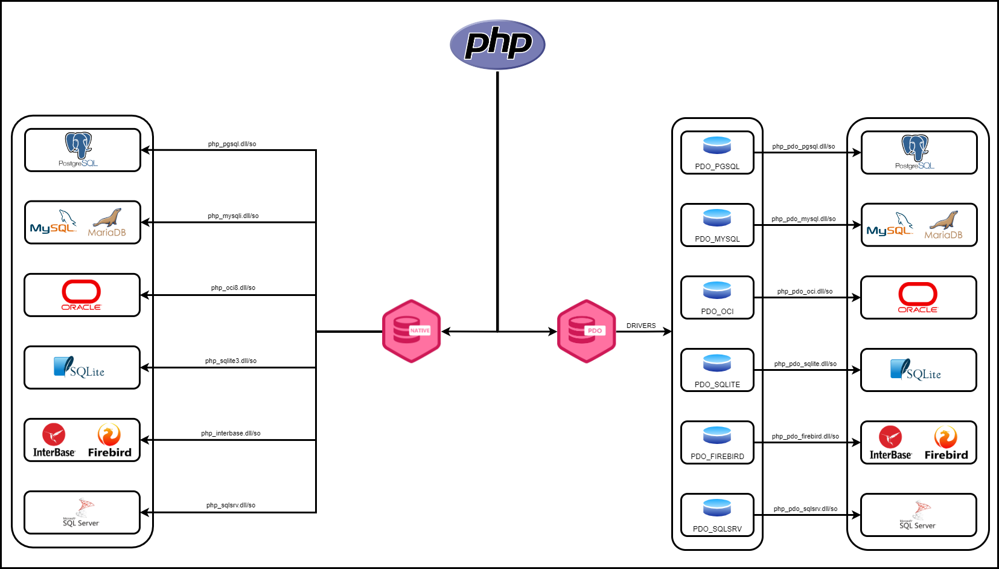

# PHP-Generic-Database 



PHP-Generic-Database é um conjunto de classes php para conexão, exibição e manipulação genérica de dados de um banco de dados, possitibilitando centralizar o padronizar todos os mais variados tipos e comportamentos de cada banco de dados em um único formato, utilizando o padrão Strategy.

## Bancos de Dados Suportados

Atualmente o PHP-Generic-Database suporte os seguintes mecanismos/banco de bados:

- mysqli
  - MySQL e MariaDB Nativos
- pgsql
  - PostgreSQL Nativo
- fbird
  - Firebird/Interbase Nativos
- sqlite
  - SQLite Nativo
- oci
  - Oracle Nativo
- sqlsvr
  - SQLServer Nativo
- pdo
  - MySQL/MariaDB
  - PostgreSQL
  - Firebird/Interbase
  - SQLite
  - Oracle
  - SQLServer

## Dependências

- PHP >= 8.1
- Composer

## Configuração

- DLLs/SO Compiladas de cada mecanismo de banco de dados para cada versão do PHP
  - Pacote de DLLs para a versão do [PHP 8.1](https://github.com/nicksonjean/PHP-Generic-Database/blob/main/resources/DLL/PHP8.1/PHP8.1.zip)
  - Pacote de DLLs para a versão do [PHP 8.2](https://github.com/nicksonjean/PHP-Generic-Database/blob/main/resources/DLL/PHP8.2/PHP8.2.zip)
- Configuração do php.ini

## Instalação Manual

1) Certifique-se que o Composer esteja instalado, caso contrário, instale a partir do [site oficial](https://getcomposer.org/download/).
2) Certifique-se que o Git esteja instalado, caso contrário, instale a partir do [site oficial](https://git-scm.com/downloads).
3) Depois de instalado o Composer e o Git, clone este repositório com a linha de comando abaixo:

```bash
git clone https://github.com/nicksonjean/PHP-Generic-Database.git
```

4) Em seguida execute o seguinte comando para instalar todos pacotes e as dependências deste projeto:

```bash
composer install
```

5) [Opcional] Caso precise reinstalar execute o seguinte comando:

```bash
composer setup
```
