# PHP-Generic-Database

<p align="center">
    
</p>

<p align="center">
    
    
</p>

[![Português](https://img.shields.io/badge/Português-Brasil-green.svg?style=for-the-badge&logo=data:image/svg+xml;base64,PHN2ZyB4bWxucz0iaHR0cDovL3d3dy53My5vcmcvMjAwMC9zdmciIHhtbG5zOnhsaW5rPSJodHRwOi8vd3d3LnczLm9yZy8xOTk5L3hsaW5rIiB2aWV3Qm94PSItMjEwMCAtMTQ3MCA0MjAwIDI5NDAiPjxkZWZzPjxwYXRoIGlkPSJpIiBmaWxsLXJ1bGU9ImV2ZW5vZGQiIGQ9Ik0tMzEuNSAwaDMzYTMwIDMwIDAgMDAzMC0zMHYtMTBhMzAgMzAgMCAwMC0zMC0zMGgtMzN6bTEzLTEzaDE5YTE5IDE5IDAgMDAxOS0xOXYtNmExOSAxOSAwIDAwLTE5LTE5aC0xOXoiLz48cGF0aCBpZD0ibiIgZD0iTS0xNS43NS0yMkMtMTUuNzUtMTUtOS0xMS41IDEtMTEuNXMxNC43NC0zLjI1IDE0Ljc1LTcuNzVjMC0xNC4yNS00Ni43NS01LjI1LTQ2LjUtMzAuMjVDLTMwLjUtNzEtNi03MCAzLTcwczI2IDQgMjUuNzUgMjEuMjVIMTMuNWMwLTcuNS03LTEwLjI1LTE1LTEwLjI1LTcuNzUgMC0xMy4yNSAxLjI1LTEzLjI1IDguNS0uMjUgMTEuNzUgNDYuMjUgNCA0Ni4yNSAyOC43NUMzMS41LTMuNSAxMy41IDAgMCAwYy0xMS41IDAtMzEuNTUtNC41LTMxLjUtMjJ6Ii8+PHBhdGggaWQ9ImwiIGQ9Ik0tMjYuMjUgMGg1Mi41di0xMmgtNDAuNXYtMTZoMzN2LTEyaC0zM3YtMTFIMjV2LTEyaC01MS4yNXoiLz48cGF0aCBpZD0iayIgZD0iTS0zMS41IDBoMTJ2LTQ4bDE0IDQ4aDExbDE0LTQ4VjBoMTJ2LTcwSDE0TDAtMjJsLTE0LTQ4aC0xNy41eiIvPjxwYXRoIGlkPSJkIiBmaWxsLXJ1bGU9ImV2ZW5vZGQiIGQ9Ik0wIDBhMzEuNSAzNSAwIDAwMC03MEEzMS41IDM1IDAgMDAwIDBtMC0xM2ExOC41IDIyIDAgMDAwLTQ0IDE4LjUgMjIgMCAwMDAgNDQiLz48cGF0aCBpZD0iZiIgZmlsbC1ydWxlPSJldmVub2RkIiBkPSJNLTMxLjUgMGgxM3YtMjZoMjhhMjIgMjIgMCAwMDAtNDRoLTQwem0xMy0zOWgyN2E5IDkgMCAwMDAtMThoLTI3eiIvPjxwYXRoIGlkPSJqIiB0cmFuc2Zvcm09InRyYW5zbGF0ZSgtMzEuNSkiIGQ9Ik0wIDBoNjN2LTEzSDEydi0xOGg0MHYtMTJIMTJ2LTE0aDQ4di0xM0gweiIvPjx1c2UgaWQ9InEiIHhsaW5rOmhyZWY9IiNhIiB0cmFuc2Zvcm09InNjYWxlKDE1KSIvPjx1c2UgaWQ9InMiIHhsaW5rOmhyZWY9IiNhIiB0cmFuc2Zvcm09InNjYWxlKDEwLjUpIi8+PHVzZSBpZD0iciIgeGxpbms6aHJlZj0iI2EiIHRyYW5zZm9ybT0ic2NhbGUoMjEpIi8+PHVzZSBpZD0ibyIgeGxpbms6aHJlZj0iI2EiIHRyYW5zZm9ybT0ic2NhbGUoMzEuNSkiLz48dXNlIGlkPSJwIiB4bGluazpocmVmPSIjYSIgdHJhbnNmb3JtPSJzY2FsZSgyNi4yNSkiLz48ZyBpZD0iYSIgZmlsbD0iI2ZmZiI+PGcgaWQ9ImMiPjxwYXRoIGlkPSJiIiB0cmFuc2Zvcm09InJvdGF0ZSgxOCAwIC0xKSIgZD0iTTAtMXYxaC41Ii8+PHVzZSB4bGluazpocmVmPSIjYiIgdHJhbnNmb3JtPSJzY2FsZSgtMSAxKSIvPjwvZz48dXNlIHhsaW5rOmhyZWY9IiNjIiB0cmFuc2Zvcm09InJvdGF0ZSg3MikiLz48dXNlIHhsaW5rOmhyZWY9IiNjIiB0cmFuc2Zvcm09InJvdGF0ZSgtNzIpIi8+PHVzZSB4bGluazpocmVmPSIjYyIgdHJhbnNmb3JtPSJyb3RhdGUoMTQ0KSIvPjx1c2UgeGxpbms6aHJlZj0iI2MiIHRyYW5zZm9ybT0icm90YXRlKDIxNikiLz48L2c+PGcgaWQ9Im0iPjxjbGlwUGF0aCBpZD0iZSI+PHBhdGggZD0iTS0zMS41IDB2LTcwaDYzVjB6TTAtNDd2MTJoMzEuNXYtMTJ6Ii8+PC9jbGlwUGF0aD48dXNlIHhsaW5rOmhyZWY9IiNkIiBjbGlwLXBhdGg9InVybCgjZSkiLz48cGF0aCBkPSJNNS0zNWgyNi41djEwSDV6Ii8+PHBhdGggZD0iTTIxLjUtMzVoMTBWMGgtMTB6Ii8+PC9nPjxnIGlkPSJoIj48dXNlIHhsaW5rOmhyZWY9IiNmIi8+PHBhdGggZD0iTTI4IDBjMC0xMCAwLTMyLTE1LTMySC02YzIyIDAgMjIgMjIgMjIgMzIiLz48L2c+PC9kZWZzPjxyZWN0IHk9Ii01MCUiIHg9Ii01MCUiIGhlaWdodD0iMTAwJSIgZmlsbD0iIzAwOWIzYSIgd2lkdGg9IjEwMCUiLz48cGF0aCBkPSJNLTE3NDMgMEwwIDExMTMgMTc0MyAwIDAtMTExM3oiIGZpbGw9IiNmZWRmMDAiLz48Y2lyY2xlIHI9IjczNSIgZmlsbD0iIzAwMjc3NiIvPjxjbGlwUGF0aCBpZD0iZyI+PGNpcmNsZSByPSI3MzUiLz48L2NsaXBQYXRoPjxwYXRoIGZpbGw9IiNmZmYiIGQ9Ik0tMjIwNSAxNDcwYTE3ODUgMTc4NSAwIDAxMzU3MCAwaC0xMDVhMTY4MCAxNjgwIDAgMTAtMzM2MCAweiIgY2xpcC1wYXRoPSJ1cmwoI2cpIi8+PGcgdHJhbnNmb3JtPSJ0cmFuc2xhdGUoLTQyMCAxNDcwKSIgZmlsbD0iIzAwOWIzYSI+PHVzZSB5PSItMTY5Ny41IiB4bGluazpocmVmPSIjZCIgdHJhbnNmb3JtPSJyb3RhdGUoLTcpIi8+PHVzZSB5PSItMTY5Ny41IiB4bGluazpocmVmPSIjaCIgdHJhbnNmb3JtPSJyb3RhdGUoLTQpIi8+PHVzZSB5PSItMTY5Ny41IiB4bGluazpocmVmPSIjaSIgdHJhbnNmb3JtPSJyb3RhdGUoLTEpIi8+PHVzZSB5PSItMTY5Ny41IiB4bGluazpocmVmPSIjaiIgdHJhbnNmb3JtPSJyb3RhdGUoMikiLz48dXNlIHk9Ii0xNjk3LjUiIHhsaW5rOmhyZWY9IiNrIiB0cmFuc2Zvcm09InJvdGF0ZSg1KSIvPjx1c2UgeT0iLTE2OTcuNSIgeGxpbms6aHJlZj0iI2wiIHRyYW5zZm9ybT0icm90YXRlKDkuNzUpIi8+PHVzZSB5PSItMTY5Ny41IiB4bGluazpocmVmPSIjZiIgdHJhbnNmb3JtPSJyb3RhdGUoMTQuNSkiLz48dXNlIHk9Ii0xNjk3LjUiIHhsaW5rOmhyZWY9IiNoIiB0cmFuc2Zvcm09InJvdGF0ZSgxNy41KSIvPjx1c2UgeT0iLTE2OTcuNSIgeGxpbms6aHJlZj0iI2QiIHRyYW5zZm9ybT0icm90YXRlKDIwLjUpIi8+PHVzZSB5PSItMTY5Ny41IiB4bGluazpocmVmPSIjbSIgdHJhbnNmb3JtPSJyb3RhdGUoMjMuNSkiLz48dXNlIHk9Ii0xNjk3LjUiIHhsaW5rOmhyZWY9IiNoIiB0cmFuc2Zvcm09InJvdGF0ZSgyNi41KSIvPjx1c2UgeT0iLTE2OTcuNSIgeGxpbms6aHJlZj0iI2oiIHRyYW5zZm9ybT0icm90YXRlKDI5LjUpIi8+PHVzZSB5PSItMTY5Ny41IiB4bGluazpocmVmPSIjbiIgdHJhbnNmb3JtPSJyb3RhdGUoMzIuNSkiLz48dXNlIHk9Ii0xNjk3LjUiIHhsaW5rOmhyZWY9IiNuIiB0cmFuc2Zvcm09InJvdGF0ZSgzNS41KSIvPjx1c2UgeT0iLTE2OTcuNSIgeGxpbms6aHJlZj0iI2QiIHRyYW5zZm9ybT0icm90YXRlKDM4LjUpIi8+PC9nPjx1c2UgeT0iLTEzMiIgeD0iLTYwMCIgeGxpbms6aHJlZj0iI28iLz48dXNlIHk9IjE3NyIgeD0iLTUzNSIgeGxpbms6aHJlZj0iI28iLz48dXNlIHk9IjI0MyIgeD0iLTYyNSIgeGxpbms6aHJlZj0iI3AiLz48dXNlIHk9IjEzMiIgeD0iLTQ2MyIgeGxpbms6aHJlZj0iI3EiLz48dXNlIHk9IjI1MCIgeD0iLTM4MiIgeGxpbms6aHJlZj0iI3AiLz48dXNlIHk9IjMyMyIgeD0iLTQwNCIgeGxpbms6aHJlZj0iI3IiLz48dXNlIHk9Ii0yMjgiIHg9IjIyOCIgeGxpbms6aHJlZj0iI28iLz48dXNlIHk9IjI1OCIgeD0iNTE1IiB4bGluazpocmVmPSIjbyIvPjx1c2UgeT0iMjY1IiB4PSI2MTciIHhsaW5rOmhyZWY9IiNyIi8+PHVzZSB5PSIzMjMiIHg9IjU0NSIgeGxpbms6aHJlZj0iI3AiLz48dXNlIHk9IjQ3NyIgeD0iMzY4IiB4bGluazpocmVmPSIjcCIvPjx1c2UgeT0iNTUxIiB4PSIzNjciIHhsaW5rOmhyZWY9IiNyIi8+PHVzZSB5PSI0MTkiIHg9IjQ0MSIgeGxpbms6aHJlZj0iI3IiLz48dXNlIHk9IjM4MiIgeD0iNTAwIiB4bGluazpocmVmPSIjcCIvPjx1c2UgeT0iNDA1IiB4PSIzNjUiIHhsaW5rOmhyZWY9IiNyIi8+PHVzZSB5PSIzMCIgeD0iLTI4MCIgeGxpbms6aHJlZj0iI3AiLz48dXNlIHk9Ii0zNyIgeD0iMjAwIiB4bGluazpocmVmPSIjciIvPjx1c2UgeT0iMzMwIiB4bGluazpocmVmPSIjbyIvPjx1c2UgeT0iMTg0IiB4PSI4NSIgeGxpbms6aHJlZj0iI3AiLz48dXNlIHk9IjExOCIgeGxpbms6aHJlZj0iI3AiLz48dXNlIHk9IjE4NCIgeD0iLTc0IiB4bGluazpocmVmPSIjciIvPjx1c2UgeT0iMjM1IiB4PSItMzciIHhsaW5rOmhyZWY9IiNxIi8+PHVzZSB5PSI0OTUiIHg9IjIyMCIgeGxpbms6aHJlZj0iI3AiLz48dXNlIHk9IjQzMCIgeD0iMjgzIiB4bGluazpocmVmPSIjciIvPjx1c2UgeT0iNDEyIiB4PSIxNjIiIHhsaW5rOmhyZWY9IiNyIi8+PHVzZSB5PSIzOTAiIHg9Ii0yOTUiIHhsaW5rOmhyZWY9IiNvIi8+PHVzZSB5PSI1NzUiIHhsaW5rOmhyZWY9IiNzIi8+PC9zdmc+)](./readme/README-pt-br.md)

PHP-Generic-Database is a set of PHP classes for connecting, displaying and generically manipulating data from a database, making it possible to centralize or standardize all the most varied types and behaviors of each database in a single format, using the standard Strategy, heavily inspired by [Medoo](https://medoo.in/) and [Dibi](https://dibiphp.com/en/) and [PowerLite](https://www.powerlitepdo.com/).

## Supported Databases

PHP-Generic-Database currently supports the following mechanisms/database:


![SQLSrv](https://img.shields.io/badge/SQLSRV-72818C?style=for-the-badge&logo=data:image/svg+xml;base64,PD94bWwgdmVyc2lvbj0iMS4wIiBlbmNvZGluZz0iVVRGLTgiPz4KPHN2ZyB2ZXJzaW9uPSIxLjEiIHhtbG5zPSJodHRwOi8vd3d3LnczLm9yZy8yMDAwL3N2ZyIgd2lkdGg9IjY0IiBoZWlnaHQ9IjY0Ij4KPHBhdGggZD0iTTAgMCBDMC4zMyAyLjk3IDAuNjYgNS45NCAxIDkgQzIuMjc4NzUgOS4wODI1IDMuNTU3NSA5LjE2NSA0Ljg3NSA5LjI1IEMxMy4xNTg0Nzk5MyAxMC4yMDA3NzY3OCAyMS42MjE1OTU3NyAxMy4zMjE1MTc5MyAyNyAyMCBDMjcgMjAuOTkgMjcgMjEuOTggMjcgMjMgQzIxLjA2IDIzLjk5IDE1LjEyIDI0Ljk4IDkgMjYgQzkuMDYxODc1IDI3Ljc3Mzc1IDkuMTIzNzUgMjkuNTQ3NSA5LjE4NzUgMzEuMzc1IEM5LjE4NzUgMzcuNDE4NzIxNzggOC4xODQ1NzAxMiA0Mi4zODk4NTk4MyA2IDQ4IEM1LjYyODc1IDQ5LjAzMTI1IDUuMjU3NSA1MC4wNjI1IDQuODc1IDUxLjEyNSBDMyA1MyAzIDUzIC0wLjg3NSA1My41NjI1IEMtNy45MTIxNTMwOSA1My4xNTgwNjU5MSAtMTUuNjI1NTYzOSA1MS4zNDY0OTc4MyAtMjEuNDQ5MjE4NzUgNDcuMjk2ODc1IEMtMjMgNDUgLTIzIDQ1IC0yMy4wNTQ2ODc1IDQxLjU2MjUgQy0yMS44MTc3NjMzMyAzNy4zODQ0NDUwMiAtMjAuMzY2MzE3OTQgMzUuODU2MTE3ODQgLTE3LjEyNSAzMyBDLTExLjYxMzQ1MzQ0IDI3Ljg0MTk3NzkgLTExLjYxMzQ1MzQ0IDI3Ljg0MTk3NzkgLTkgMjEgQy05LjM3MDMwNDY3IDE1LjEzNTE3NDY2IC0xMC43ODk5Mzk3NiAxMi4wNjQ4ODU3NSAtMTUgOCBDLTE0LjkxNDA2MjUgNS41MzkwNjI1IC0xNC45MTQwNjI1IDUuNTM5MDYyNSAtMTQgMyBDLTExLjg1NTQ2ODc1IDEuNjAxNTYyNSAtMTEuODU1NDY4NzUgMS42MDE1NjI1IC05LjE4NzUgMC42MjUgQy04LjMxNDgwNDY5IDAuMjg3MjY1NjIgLTcuNDQyMTA5MzggLTAuMDUwNDY4NzUgLTYuNTQyOTY4NzUgLTAuMzk4NDM3NSBDLTQgLTEgLTQgLTEgMCAwIFogTS02IDIgQy01LjY3IDIuNjYgLTUuMzQgMy4zMiAtNSA0IEMtNC4zNCA0IC0zLjY4IDQgLTMgNCBDLTMgMy4zNCAtMyAyLjY4IC0zIDIgQy0zLjk5IDIgLTQuOTggMiAtNiAyIFogTS0xMiA1IEMtMTIgNS42NiAtMTIgNi4zMiAtMTIgNyBDLTExLjM0IDYuNjcgLTEwLjY4IDYuMzQgLTEwIDYgQy0xMC42NiA1LjY3IC0xMS4zMiA1LjM0IC0xMiA1IFogTS05IDEwIEMtOC4zNCAxMC42NiAtNy42OCAxMS4zMiAtNyAxMiBDLTYuMzQgMTEuMzQgLTUuNjggMTAuNjggLTUgMTAgQy02LjMyIDEwIC03LjY0IDEwIC05IDEwIFogTS0zIDExIEMtMy45OSAxMi40ODUgLTMuOTkgMTIuNDg1IC01IDE0IEMtNC4wMSAxNCAtMy4wMiAxNCAtMiAxNCBDLTIuMzMgMTMuMDEgLTIuNjYgMTIuMDIgLTMgMTEgWiBNMCAxMSBDMC4zMyAxMS42NiAwLjY2IDEyLjMyIDEgMTMgQzEuNjYgMTIuNjcgMi4zMiAxMi4zNCAzIDEyIEMyLjAxIDExLjY3IDEuMDIgMTEuMzQgMCAxMSBaIE04IDEzIEM3LjY3IDEzLjk5IDcuMzQgMTQuOTggNyAxNiBDOC42NSAxNS42NyAxMC4zIDE1LjM0IDEyIDE1IEMxMiAxNC4zNCAxMiAxMy42OCAxMiAxMyBDMTAuNjggMTMgOS4zNiAxMyA4IDEzIFogTTQgMTQgQzMuMzQgMTQuNjYgMi42OCAxNS4zMiAyIDE2IEMyLjk5IDE2IDMuOTggMTYgNSAxNiBDNC42NyAxNS4zNCA0LjM0IDE0LjY4IDQgMTQgWiBNLTYgMTYgQy01LjY3IDE2LjY2IC01LjM0IDE3LjMyIC01IDE4IEMtNC4zNCAxNy4zNCAtMy42OCAxNi42OCAtMyAxNiBDLTMuOTkgMTYgLTQuOTggMTYgLTYgMTYgWiBNMTcgMTYgQzE2LjAxIDE3Ljk4IDE1LjAyIDE5Ljk2IDE0IDIyIEMxNy40NjUgMjEuNTA1IDE3LjQ2NSAyMS41MDUgMjEgMjEgQzIxIDIwLjAxIDIxIDE5LjAyIDIxIDE4IEMxOS42OCAxNy4zNCAxOC4zNiAxNi42OCAxNyAxNiBaIE04IDE4IEM4LjY2IDE5LjMyIDkuMzIgMjAuNjQgMTAgMjIgQzExLjMyIDIwLjY4IDEyLjY0IDE5LjM2IDE0IDE4IEMxMSAxNi42NjY2NjY2NyAxMSAxNi42NjY2NjY2NyA4IDE4IFogTTUgMjAgQzQuMzQgMjEuMzIgMy42OCAyMi42NCAzIDI0IEM0LjY1IDIzLjY3IDYuMyAyMy4zNCA4IDIzIEM3LjAxIDIyLjAxIDYuMDIgMjEuMDIgNSAyMCBaIE0tNCAyNSBDLTQuMzMgMjUuNjYgLTQuNjYgMjYuMzIgLTUgMjcgQy00LjM0IDI3IC0zLjY4IDI3IC0zIDI3IEMtMy4zMyAyNi4zNCAtMy42NiAyNS42OCAtNCAyNSBaIE0tNCAyOSBDLTMuMzQgMzAuMzIgLTIuNjggMzEuNjQgLTIgMzMgQy0yIDMxLjY4IC0yIDMwLjM2IC0yIDI5IEMtMi42NiAyOSAtMy4zMiAyOSAtNCAyOSBaIE0xIDI5IEMwLjY3IDMwLjMyIDAuMzQgMzEuNjQgMCAzMyBDMS42NSAzMi4zNCAzLjMgMzEuNjggNSAzMSBDMy42OCAzMC4zNCAyLjM2IDI5LjY4IDEgMjkgWiBNLTcgMzEgQy03LjY2IDMyLjk4IC04LjMyIDM0Ljk2IC05IDM3IEMtNy4zNSAzNi4zNCAtNS43IDM1LjY4IC00IDM1IEMtNC45OSAzMy42OCAtNS45OCAzMi4zNiAtNyAzMSBaIE0tMTIgMzMgQy0xMS42NyAzNC4zMiAtMTEuMzQgMzUuNjQgLTExIDM3IEMtMTAuNjcgMzUuNjggLTEwLjM0IDM0LjM2IC0xMCAzMyBDLTEwLjY2IDMzIC0xMS4zMiAzMyAtMTIgMzMgWiBNNCAzMyBDMy4wMSAzNC40ODUgMy4wMSAzNC40ODUgMiAzNiBDMy4zMiAzNiA0LjY0IDM2IDYgMzYgQzYgMzUuMDEgNiAzNC4wMiA2IDMzIEM1LjM0IDMzIDQuNjggMzMgNCAzMyBaIE0tMTcgMzYgQy0xNy45OSAzNy40ODUgLTE3Ljk5IDM3LjQ4NSAtMTkgMzkgQy0xNy4zNSAzOSAtMTUuNyAzOSAtMTQgMzkgQy0xNC4zMyAzOC4wMSAtMTQuNjYgMzcuMDIgLTE1IDM2IEMtMTUuNjYgMzYgLTE2LjMyIDM2IC0xNyAzNiBaIE0tMSAzNyBDLTEuNjYgMzguMzIgLTIuMzIgMzkuNjQgLTMgNDEgQy0xLjAyIDQwLjM0IDAuOTYgMzkuNjggMyAzOSBDMS42OCAzOC4zNCAwLjM2IDM3LjY4IC0xIDM3IFogTS04IDM5IEMtOC4zMyAzOS42NiAtOC42NiA0MC4zMiAtOSA0MSBDLTguMDEgNDEuMzMgLTcuMDIgNDEuNjYgLTYgNDIgQy01LjY3IDQxLjAxIC01LjM0IDQwLjAyIC01IDM5IEMtNS45OSAzOSAtNi45OCAzOSAtOCAzOSBaIE0tMiA0MyBDLTIgNDMuMzMgLTIgNDMuNjYgLTIgNDQgQzAuOTcgNDQuNDk1IDAuOTcgNDQuNDk1IDQgNDUgQzQuNjYgNDMuMzUgNS4zMiA0MS43IDYgNDAgQzIuOTE5OTAxMjEgNDAgMC42ODg2NDg2NCA0MS41OTcyMjY4IC0yIDQzIFogTS0yMSA0MiBDLTIwLjY3IDQyLjk5IC0yMC4zNCA0My45OCAtMjAgNDUgQy0xOC42OCA0NC4zNCAtMTcuMzYgNDMuNjggLTE2IDQzIEMtMTYgNDIuNjcgLTE2IDQyLjM0IC0xNiA0MiBDLTE3LjY1IDQyIC0xOS4zIDQyIC0yMSA0MiBaIE0tMTMgNDIgQy0xMy4zMyA0Mi45OSAtMTMuNjYgNDMuOTggLTE0IDQ1IEMtMTIuMzUgNDQuNjcgLTEwLjcgNDQuMzQgLTkgNDQgQy0xMC4zMiA0My4zNCAtMTEuNjQgNDIuNjggLTEzIDQyIFogTS01IDQ1IEMtNS45OSA0Ni40ODUgLTUuOTkgNDYuNDg1IC03IDQ4IEMtMy41MzUgNDcuNTA1IC0zLjUzNSA0Ny41MDUgMCA0NyBDLTIuMzgxNjIwMDkgNDUuNTg2MTQwODkgLTIuMzgxNjIwMDkgNDUuNTg2MTQwODkgLTUgNDUgWiBNLTEyIDQ3IEMtMTIuMzMgNDcuNjYgLTEyLjY2IDQ4LjMyIC0xMyA0OSBDLTEyLjAxIDQ4LjY3IC0xMS4wMiA0OC4zNCAtMTAgNDggQy0xMC42NiA0Ny42NyAtMTEuMzIgNDcuMzQgLTEyIDQ3IFogTS0xIDQ5IEMtMC4zNCA0OS42NiAwLjMyIDUwLjMyIDEgNTEgQzEuMzMgNTAuMzQgMS42NiA0OS42OCAyIDQ5IEMxLjAxIDQ5IDAuMDIgNDkgLTEgNDkgWiAiIGZpbGw9IiNGRkZGRkYiIHRyYW5zZm9ybT0idHJhbnNsYXRlKDMxLDUpIi8+Cjwvc3ZnPgo=&logoColor=white)
![Oracle](https://img.shields.io/badge/Oracle-C84734?style=for-the-badge&logo=data:image/svg+xml;base64,PD94bWwgdmVyc2lvbj0iMS4wIiBlbmNvZGluZz0idXRmLTgiPz48IS0tIFVwbG9hZGVkIHRvOiBTVkcgUmVwbywgd3d3LnN2Z3JlcG8uY29tLCBHZW5lcmF0b3I6IFNWRyBSZXBvIE1peGVyIFRvb2xzIC0tPgo8c3ZnIHdpZHRoPSI4MDBweCIgaGVpZ2h0PSI4MDBweCIgdmlld0JveD0iMCAwIDI0IDI0IiB4bWxucz0iaHR0cDovL3d3dy53My5vcmcvMjAwMC9zdmciPgogIDxwYXRoIGZpbGw9IiNGRkYiIGZpbGwtcnVsZT0iZXZlbm9kZCIgZD0iTTcuOTU3MzU5LDE4LjkxMjM2NjQgQzQuMTE2NzAyNTIsMTguOTEyMzY2NCAxLDE1LjgwMzQ1OCAxLDExLjk2MTczNzMgQzEsOC4xMjAwMDc3MyA0LjExNjcwMjUyLDUgNy45NTczNTksNSBMMTYuMDQzNzk0OCw1IEMxOS44ODU1MTU2LDUgMjMsOC4xMjAwMDc3MyAyMywxMS45NjE3MzczIEMyMywxNS44MDM0NTggMTkuODg1NTE1NiwxOC45MTIzNjY0IDE2LjA0Mzc5NDgsMTguOTEyMzY2NCBMNy45NTczNTksMTguOTEyMzY2NCBMNy45NTczNTksMTguOTEyMzY2NCBaIE0xNS44NjM5MTc2LDE2LjQ1ODU0ODggQzE4LjM1MjIwMSwxNi40NTg1NDg4IDIwLjM2NzQzOTcsMTQuNDQ4ODU4IDIwLjM2NzQzOTcsMTEuOTYxNzM3MyBDMjAuMzY3NDM5Nyw5LjQ3NDYwNTk1IDE4LjM1MjIwMSw3LjQ1MzgxOTM0IDE1Ljg2MzkxNzYsNy40NTM4MTkzNCBMOC4xMzYwODI0LDcuNDUzODE5MzQgQzUuNjQ4OTUyODUsNy40NTM4MTkzNCAzLjYzMjU1ODU1LDkuNDc0NjA1OTUgMy42MzI1NTg1NSwxMS45NjE3MzczIEMzLjYzMjU1ODU1LDE0LjQ0ODg1OCA1LjY0ODk1Mjg1LDE2LjQ1ODU0ODggOC4xMzYwODI0LDE2LjQ1ODU0ODggTDE1Ljg2MzkxNzYsMTYuNDU4NTQ4OCBMMTUuODYzOTE3NiwxNi40NTg1NDg4IFoiLz4KPC9zdmc+&logoColor=white)

![Interbase](https://img.shields.io/badge/Interbase-FF0000?style=for-the-badge&logo=data:image/png;base64,iVBORw0KGgoAAAANSUhEUgAAANEAAADRCAMAAABl5KfdAAAAgVBMVEUAAAD///////////////////////////////////////////////////////////////////////////////////////////////////////////////////////////////////////////////////////////////////////9d3yJTAAAAKnRSTlMAMpXxm6Hg1Puql/fKss+e7GqK6eLGwKPdu3HYeua3g3VSkGHzWkKlSX+etyczAAAE0UlEQVR42uzZ2XKqQBSF4bUdGASN4BBn45ys93/AUyIGpRFMDBzo4rvxyqJ+pXsXDWq1Wq1Wq9VqtVqtVqvVbsmUZyZ0YTO0gRZmFq++oIMRI4LqO1qMuKi+FqnXX+TyloFsctiuzIFDlnJzlAHvfCCdNNwm71koE+G9PVLItmcxwRvKY8OYxuOc9pAPdFEaM8bJo5wBVeWbyevnfm3xDaZ5R1lsqRAoNiOyIkENKlx1LxiwykGUWM+KrE7QlioDtw4mqxS0ZoIFIoshKxX0wUjSdPWbrFbQjklmCG0d/jCI5KDr7Xb4T4QJJoKLjsVngyLhd+Y7QSGyg/oeLhoWfxEEeN6cgeaosSk6y2Kc5ePCd/jzoChqNuLFcOoXWNVn3AkXsz6f1kYyOS0ZmnQXhWSZjBkJApshXwmKiN/jlWOe8l5aU94bCgLS48tBEfGmTQbCpXXMLavFe+vo9PG1IJW0Dd5YTn3JIWuW/PDwxheCUsja5Z1J90ty3LfnEmbu8wgKyaHb5x3HtGeSx75tLRCQOfMJikhHuUbTbR2ULBG/65qGYbr2+rnmoXrDyYo5BKnkY+wwbjDeiiD0aRu85Yw8ZBnz21IQWDO3IJXYS56pS0uOK4cq512QSjnxESP3IHVU/eX1GOqF5V0WEqSOqj2ft//MLppF71eKD1JHlcoTMRmxM4rGCIjJAoOyR1WsQHijh0cWDvs7BDrMUMhh8HlUqXwAcHhjiYck/FiWIujBqDLVR7gl0tksTdCZLGJRvUVLrUxxbJYr6Oy4ZAYbD61YviAAbWbYINnB4a+0kbcN0zlINGZZgwBhuhNUnlXiIOCT6STpebyca+iq87PN4bgvexAwYRorPoPKHwRhqg9EZFCFIGDENC6+NViNIMhze4OYVQkCBkzjIeCxOkEZy32Ms1WVgrDLvO2kz99roXDCdJM5qxUEOExXuSD0eaVJEIYM6RL0XaRN0LVIn6CwSKOgS5FOQTBIahV0LtIrCIZuQTB0C4KhWxAM3YJg6BYEQ7cgGLoFwdAtCBPdgjDnX+mgHFzdgtDVLQgd3YLg6RYE0S0IcHQLQk+3IHR0C4LoFgT0dQuCzRc0UEKiWxAw1y0Inm5B/9q7u90EgSAMwy9OqhKtISJGG2tNf5O5/wtsTdvYhD2yHjAf89zBm4WFBV2gUQvipBYEj2pBvKsFwVYtCOZqQbypBUGtFgQztSBo1IJgoRYEc7UgWKgFgakFQaMWBK1aEGzUgmCnFgSzoe/Hdn2S0OaOS7kiOr8Y6O6TN1jUdsS2929CG7/ee8+K2ASTar2ku0wKYDKKpOiX2lovqdO71Lbesye0ahB/obypk/c9ENpWbrlUeZ8R2sH7toS2874DkVXjeJYS+w6v8oITka38y6C/5HGTrXhqImvlJodnV7soVS43SDO5QVrLDVKl91qplRuko5esievgJVPiqlzusJt7yQdxTb2kIa5O7rCrB/1f5WtMvGhHWC8ud9i17mqrc3N3sQf7pjZ/g4mdSICJnUjlpCOx9ZM2BGdiJxJgckWY0EL2h2lNDWemcrN6YTpvKX6Z1tRwZoP8Ove/mNRkx5mJvBv7w1R+znVhAk9Wy0mv6DCBZWwp6QklSzetINC4YUgppZRSSimllMbqE+pyG80XO1J+AAAAAElFTkSuQmCC)


## Features

- **Lightweight** - Light, simple and minimalist, easy to use and with a low learning curve.
- **Agnostic** - It can be used in different ways, supporting chainable methods, fluent design, dynamic arguments and static array.
- **Easy** - Easy to learn and use, with a friendly construction.
- **Powerful** - Supports various common and complex SQL queries, data mapping and prevents SQL injection.
- **Compatible** - Supports MySQL/MariaDB, SQLSrv/MSSQL, Interbase/Firebird, PgSQL, OCI, SQLite, and more.
- **Auto Escape** - Automatically escape SQL queries according to the driver dialect or SQL engine used.
- **Friendly** - Works well with every PHP framework, such as Laravel, Codeigniter, CakePHP, and frameworks that support singleton extension or composer.
- **Free** - Under the MIT license, you can use it anywhere, for whatever purpose.

## Requirements

- **PHP >= 8.0**
- **Composer**
- **Native Extensions**
  - **MySQL/MariaDB** ***(MySQLi)*** *[php_mysqli.dll/so]*
  - **PostgreSQL** ***(PgSQL)*** *[php_pgsql.dll/so]*
  - **Oracle** ***(OCI8)*** *[php_oci8_***.dll/so]*
  - **SQL Server** ***(sqlsrv)*** *[php_sqlsrv.dll/so]*
  - **Firebird/Interbase** ***(ibase: gds | firebird: fds)*** *[php_interbase.dll/so]*
  - **SQLite** ***(SQLite3)*** *[php_sqlite3.dll/so]*
- **PDO Extensions**
  - **MySQL/MariaDB** ***(MySQL)*** *[php_pdo_mysql.dll/so]*
  - **PostgreSQL** ***(PgSQL)*** *[php_pdo_pgsql.dll/so]*
  - **Oracle** ***(OCI)*** *[php_pdo_oci.dll/so]*
  - **SQL Server** ***(sqlsrv)*** *[php_pdo_sqlsrv.dll/so]*
  - **Firebird/Interbase** ***(ibase: gds | firebird: fds)*** *[php_pdo_firebird.dll/so]*
  - **SQLite** ***(SQLite)*** *[php_pdo_sqlite.dll/so]*
  - **ODBC** ***(ODBC)*** *[php_pdo_obdc.dll/so]*
- **ODBC Externsions**
  - **MySQL/MariaDB** ***(MySQL)*** *[myodbc8a.dll/so]*
  - **PostgreSQL** ***(PgSQL)*** *[psqlodbc30a.dll/so]*
  - **OCI** ***(ORACLE)*** *[sqora32.dll/so]*
  - **SQL Server** ***(sqlsrv)*** *[sqlsrv32.dll/so]*
  - **Firebird/Interbase** ***(ibase: gds | firebird: fds)*** *[odbcFb.dll/so]*
  - **SQLite** ***(SQLite)*** *[sqlite3odbc.dll/so]*
  - **Access** ***(Access)*** *[aceodbc.dll/so]*
  - **Excel** ***(Excel)*** *[aceodexl.dll/so]*
  - **Text** ***(Text)*** *[aceodtxt.dll/so]*
- **Optional External Formats**
  - **INI** ***(php native compilation)***
  - **XML** ***(ext-libxml, ext-xmlreader, ext-simplexml)***
  - **JSON** ***(php native compilation)***
  - **YAML** ***(ext-yaml)***
  - **NEON** ***[(nette/neon)](https://github.com/nette/neon)***

## Local Instalation with XAMPP

1) Make sure Git is installed, otherwise install from the [official website](https://git-scm.com/downloads).

```bash
git clone https://github.com/nicksonjean/PHP-Generic-Database.git
```

2. Install the [XAMPP](https://www.apachefriends.org/pt_br/index.html).

### Only for Windows

3. Navigate to the `assets/DLL` folder, select the PHP version you installed, and extract the DLL package containing the compiled libraries for each database engine.  
  3.1. DLL package for [PHP 8.0](./assets/DLL/PHP8.0/PHP8.0.zip).  
  3.2. DLL package for [PHP 8.1](./assets/DLL/PHP8.1/PHP8.1.zip).  
  3.3. DLL package for [PHP 8.2](./assets/DLL/PHP8.2/PHP8.2.zip).  
  3.4. DLL package for [PHP 8.3](./assets/DLL/PHP8.3/PHP8.3.zip).  
4. Copy the files from the `DLL` folder to the `PHP/ext` directory.
5. Open the `php.ini` file and uncomment the extensions you want to use, edit the `php.ini` file and remove the &#039;;&#039; for the database extension you want to install as shown in the example below:  

- From

```ini
;extension=php_pdo_mysql.dll
```

- To

```ini
extension=php_pdo_mysql.dll
```

### Only for Linux and MacOS

3. Download the third party libraries like a Oracle and SQLSrv for each database engine and extract them to the `PHP/ext` directory.
4. Compile the PHP source code and install the PHP extension you want to use.
5. Open the `php.ini` file and uncomment the extensions you want to use, edit the `php.ini` file and remove the &#039;;&#039; for the database extension you want to install as shown in the example below:  

- From

```ini

```

- To

```ini
extension=php_pdo_mysql.so
```

### for All Systems

6. Save it, and restart the PHP or Apache Server.
7. If the extension is installed successfully, you can find it on phpinfo() output.
8) Make sure Composer is installed, otherwise install from the [official website](https://getcomposer.org/download/).
9) After Composer and Git are installed, clone this repository with the command line below:
10) Then run the following command to install all packages and dependencies for this project:

```bash
composer install
```

11) [Optional] If you need to reinstall, run the following command:

```bash
composer setup
```

## Local Installation via Docker

1) Make sure Docker Desktop is installed, otherwise install from the [official website](https://www.docker.com/products/docker-desktop/).
2) Create an account to use Docker Desktop/Hub, and be able to clone containers hosted on the Docker network.
3) Once logged in to Docker Hub and with Docker Desktop open on your system, run the command below:

```bash
docker pull php-generic-database:8.3-full
```

or

### Only for Windows

```bash
.\setup.bat --build-arg PHP_VERSION=8.3 --build-arg PHP_PORT=8300 --run "docker compose up -d"
```

### Only for Linux and MacOS

```bash
.\setup.sh --build-arg PHP_VERSION=8.3 --build-arg PHP_PORT=8300 --run "docker compose up -d"
```

4) Docker will download, install and configure a Debian-Like Linux Custom Image as Apache and with PHP 8.x in the choosed port with all Extensions properly configured.

## Documentation

A complete documentation of the lib is available at [Complete Documentation](./docs/index.html).

### How to use

Below is a series of readmes containing examples of how to use the lib and a [topology](./assets/topology.png) image of the native drivers and pdo.

- Connection:
  - Strategy:
    - [Chainable.md](./readme/Connection/Strategy/Chainable.md)
    - [Fluent.md](./readme/Connection/Strategy/Fluent.md)
    - [StaticArgs.md](./readme/Connection/Strategy/StaticArgs.md)
    - [StaticArray.md](./readme/Connection/Strategy/StaticArray.md)
  - Modules:
    - [Chainable.md](./readme/Connection/Modules/Chainable.md)
    - [Fluent.md](./readme/Connection/Modules/Fluent.md)
    - [StaticArgs.md](./readme/Connection/Modules/StaticArgs.md)
    - [StaticArray.md](./readme/Connection/Modules/StaticArray.md)
  - Engines:
    - MySQL/MariaDB with mysqli: [MySQLiConnection.md](./readme/Engines/MySQLiConnection.md)
    - Firebird/Interbase with fbird/ibase: [FirebirdConnection.md](./readme/Engines/FirebirdConnection.md)
    - Oracle with oci8: [OCIConnection.md](./readme/Engines/OCIConnection.md)
    - PostgreSQL with pgsql: [PgSQLConnection.md](./readme/Engines/PgSQLConnection.md)
    - SQL Server with sqlsrv: [SQLSrvConnection.md](./readme/Engines/SQLSrvConnection.md)
    - SQLite with sqlite3: [SQLiteConnection.md](./readme/Engines/SQLiteConnection.md)
    - PDO:
      - [Chainable.md](./readme/Engines/PDOConnection/Chainable.md)
      - [Fluent.md](./readme/Engines/PDOConnection/Fluent.md)
      - [StaticArgs.md](./readme/Engines/PDOConnection/StaticArgs.md)
      - [StaticArray.md](./readme/Engines/PDOConnection/StaticArray.md)
    - ODBC:
      - [Chainable.md](./readme/Engines/ODBCConnection/Chainable.md)
      - [Fluent.md](./readme/Engines/ODBCConnection/Fluent.md)
      - [StaticArgs.md](./readme/Engines/ODBCConnection/StaticArgs.md)
      - [StaticArray.md](./readme/Engines/ODBCConnection/StaticArray.md)
  - Statements: [Statements.md](./readme/Statements.md)
  - Fetches: [Fetches.md](./readme/Fetches.md)
- QueryBuilder:
  - Strategy:
    - [StrategyQueryBuilder.md](./readme/QueryBuilder/StrategyQueryBuilder.md)
  - Engines:
    - MySQL/MariaDB with mysqli: [MySQLiQueryBuilder.md](./readme/Engines/MySQLiQueryBuilder.md)
    - Firebird/Interbase with fbird/ibase: [FirebirdQueryBuilder.md](./readme/Engines/FirebirdQueryBuilder.md)
    - Oracle with oci8: [OCIQueryBuilder.md](./readme/Engines/OCIQueryBuilder.md)
    - PostgreSQL with pgsql: [PgSQLQueryBuilder.md](./readme/Engines/PgSQLQueryBuilder.md)
    - SQL Server with sqlsrv: [SQLSrvQueryBuilder.md](./readme/Engines/SQLSrvQueryBuilder.md)
    - SQLite with sqlite3: [SQLiteQueryBuilder.md](./readme/Engines/SQLiteQueryBuilder.md)
    - PDO: [PDOQueryBuilder.md](./readme/Engines/PDOQueryBuilder.md)
    - ODBC: [ODBCQueryBuilder.md](./readme/Engines/ODBCQueryBuilder.md)

## Diagram

The vertical flowchart/diagram also (from top to bottom) clearly shows the organization of your directory structure, as it allows a more natural visualization of the file and folder hierarchy, for the database abstraction library with support for multiple engines (MySQL, PostgreSQL, SQLite, SQL Server, Firebird, OCI and ODBC), as well as a well-defined structure of abstract classes, interfaces and helpers.

```mermaid
flowchart TB
    Root["PHP Generic Database"]
    
    Root --- Connection["Connection.php"]
    Root --- QueryBuilder["QueryBuilder.php"]
    Root --- Abstract["Abstract/"]
    Root --- Core["Core/"]
    Root --- Engine["Engine/"]
    Root --- Generic["Generic/"]
    Root --- Helpers["Helpers/"]
    Root --- Interfaces["Interfaces/"]
    Root --- Modules["Modules/"]
    Root --- Shared["Shared/"]
    
    Abstract --- AbstractFiles["
        AbstractArguments.php
        AbstractAttributes.php
        AbstractFetch.php
        AbstractOptions.php
        AbstractStatements.php
    "]
    
    Core --- CoreFiles["
        Build.php
        Column.php
        Condition.php
        Entity.php
        Grouping.php
        Having.php
        Insert.php
        Join.php
        Junction.php
        Limit.php
        Query.php
        Select.php
        Sorting.php
        Table.php
        Types.php
        Where.php
    "]
    Core --- Emulated["Emulated/"]
    Core --- Native["Native/"]
    
    Emulated --- EmulatedFiles["
        Build.php
        Column.php
        Condition.php
        Entity.php
        Grouping.php
        Having.php
        Insert.php
        Join.php
        Junction.php
        Limit.php
        Query.php
        Select.php
        Sorting.php
        Table.php
        Types.php
        Where.php
    "]
    
    Native --- NativeFiles["
        Build.php
        Column.php
        Condition.php
        Entity.php
        Grouping.php
        Having.php
        Insert.php
        Join.php
        Junction.php
        Limit.php
        Query.php
        Select.php
        Sorting.php
        Table.php
        Types.php
        Where.php
    "]
    
    Engine --- EngineFiles["
        FirebirdConnection.php
        FirebirdQueryBuilder.php
        MySQLiConnection.php
        MySQLiQueryBuilder.php
        OCIConnection.php
        OCIQueryBuilder.php
        ODBCConnection.php
        ODBCQueryBuilder.php
        PDOConnection.php
        PDOQueryBuilder.php
        PgSQLConnection.php
        PgSQLQueryBuilder.php
        SQLiteConnection.php
        SQLiteQueryBuilder.php
        SQLSrvConnection.php
        SQLSrvQueryBuilder.php
    "]
    
    Engine --- FirebirdDir["Firebird/"]
    Engine --- MySQLiDir["MySQLi/"]
    Engine --- OCIDir["OCI/"]
    Engine --- ODBCDir["ODBC/"]
    Engine --- PDODir["PDO/"]
    Engine --- PgSQLDir["PgSQL/"]
    Engine --- SQLiteDir["SQLite/"]
    Engine --- SQLSrvDir["SQLSrv/"]
    
    FirebirdDir --- FirebirdSubdir["
        Connection/
        QueryBuilder/
    "]
    
    FirebirdSubdir --- FirebirdConnection["Connection:
        Firebird.php
        Arguments/
        Attributes/
        DSN/
        Fetch/
        Options/
        Report/
        Statements/
        Transactions/
    "]
    
    FirebirdSubdir --- FirebirdBuilder["QueryBuilder:
        Builder.php
        Context.php
        Criteria.php
        Internal.php
        Query.php
        Regex.php
    "]
    
    MySQLiDir --- MySQLiSubdir["
        Connection/
        QueryBuilder/
    "]
    
    MySQLiSubdir --- MySQLiConnection["Connection:
        MySQL.php
        Arguments/
        Attributes/
        DSN/
        Fetch/
        Options/
        Report/
        Statements/
        Transactions/
    "]
    
    MySQLiSubdir --- MySQLiBuilder["QueryBuilder:
        Builder.php
        Context.php
        Criteria.php
        Internal.php
        Query.php
        Regex.php
    "]
    
    OCIDir --- OCISubdir["
        Connection/
        QueryBuilder/
    "]

    OCISubdir --- OCIConnection["Connection:
        OCI.php
        Arguments/
        Attributes/
        DSN/
        Fetch/
        Options/
        Report/
        Statements/
        Transactions/
    "]
    
    OCISubdir --- OCIBuilder["QueryBuilder:
        Builder.php
        Context.php
        Criteria.php
        Internal.php
        Query.php
        Regex.php
    "]
    
    ODBCDir --- ODBCSubdir["
        Connection/
        QueryBuilder/
    "]

    ODBCSubdir --- ODBCConnection["Connection:
        ODBC.php
        Arguments/
        Attributes/
        DSN/
        Fetch/
        Options/
        Report/
        Statements/
        Transactions/
    "]
    
    ODBCSubdir --- ODBCBuilder["QueryBuilder:
        Builder.php
        Context.php
        Criteria.php
        Internal.php
        Query.php
        Regex.php
    "]
    
    PDODir --- PDOSubdir["
        Connection/
        QueryBuilder/
    "]
    
    PDOSubdir --- PDOConnection["Connection:
        XPDO.php
        Arguments/
        Attributes/
        DSN/
        Fetch/
        Options/
        Report/
        Statements/
        Transactions/
    "]
    
    PDOSubdir --- PDOBuilder["QueryBuilder:
        Builder.php
        Context.php
        Criteria.php
        Internal.php
        Query.php
        Regex.php
    "]
    
    PgSQLDir --- PgSQLSubdir["
        Connection/
        QueryBuilder/
    "]

    PgSQLSubdir --- PgSQLConnection["Connection:
        PgSQL.php
        Arguments/
        Attributes/
        DSN/
        Fetch/
        Options/
        Report/
        Statements/
        Transactions/
    "]
    
    PgSQLSubdir --- PgSQLBuilder["QueryBuilder:
        Builder.php
        Context.php
        Criteria.php
        Internal.php
        Query.php
        Regex.php
    "]
    
    SQLiteDir --- SQLiteSubdir["
        Connection/
        QueryBuilder/
    "]

    SQLiteSubdir --- SQLiteConnection["Connection:
        SQLite.php
        Arguments/
        Attributes/
        DSN/
        Fetch/
        Options/
        Report/
        Statements/
        Transactions/
    "]
    
    SQLiteSubdir --- SQLiteBuilder["QueryBuilder:
        Builder.php
        Context.php
        Criteria.php
        Internal.php
        Query.php
        Regex.php
    "]
    
    SQLSrvDir --- SQLSrvSubdir["
        Connection/
        QueryBuilder/
    "]
    
    SQLSrvSubdir --- SQLSrvConnection["Connection:
        SQLSrv.php
        Arguments/
        Attributes/
        DSN/
        Fetch/
        Options/
        Report/
        Statements/
        Transactions/
    "]
    
    SQLSrvSubdir --- SQLSrvBuilder["QueryBuilder:
        Builder.php
        Context.php
        Criteria.php
        Internal.php
        Query.php
        Regex.php
    "]
    
    Generic --- GenericDir["
        Connection/
        Fetch/
        Statements/
    "]
    
    GenericDir --- GenericConnection["Connection:
        Methods.php
        Settings.php
    "]
    
    GenericDir --- GenericFetch["Fetch:
        FetchCache.php
    "]
    
    GenericDir --- GenericStatements["Statements:
        Metadata.php
        QueryMetadata.php
        RowsMetadata.php
    "]
    
    Helpers --- HelpersFiles["
        Compare.php
        Errors.php
        Exceptions.php
        Generators.php
        Hash.php
        Path.php
        Reflections.php
        Schemas.php
        Validations.php
    "]
    
    Helpers --- ParsersDir["Parsers/"]
    Helpers --- TypesDir["Types/"]
    
    ParsersDir --- ParsersFiles["
        INI.php
        JSON.php
        NEON.php
        SQL.php
        TXT.php
        XML.php
        YAML.php
        SQL/
    "]
    
    TypesDir --- TypesSubdirs["
        Compounds/
        Scalars/
        Specials/
    "]
    
    TypesSubdirs --- CompoundsDir["Compounds:
        Arrays.php
    "]
    
    TypesSubdirs --- ScalarsDir["Scalars:
        Strings.php
    "]
    
    TypesSubdirs --- SpecialsDir["Specials:
        Datetimes.php
        Resources.php
        Datetimes/
    "]
    
    Interfaces --- InterfacesFiles["
        IConnection.php
        IQueryBuilder.php
    "]
    
    Interfaces --- ConnectionInterfaces["Connection/"]
    Interfaces --- QueryBuilderInterfaces["QueryBuilder/"]
    Interfaces --- StrategyInterfaces["Strategy/"]
    
    ConnectionInterfaces --- ConnInterfaceFiles["
        IArguments.php
        IArgumentsAbstract.php
        IArgumentsStrategy.php
        IAttributes.php
        IAttributesAbstract.php
        IConstants.php
        IDSN.php
        IFetch.php
        IFetchAbstract.php
        IFetchStrategy.php
        IOptions.php
        IOptionsAbstract.php
        IReport.php
        IStatements.php
        IStatementsAbstract.php
        ITransactions.php
    "]
    
    StrategyInterfaces --- StrategyInterfaceFiles["
        IConnectionStrategy.php
        IQueryBuilderStrategy.php
    "]
    
    Modules --- ModulesFiles["
        Chainable.php
        Fluent.php
        StaticArgs.php
        StaticArray.php
    "]
    
    Shared --- SharedFiles["
        Caller.php
        Cleaner.php
        Enumerator.php
        Getter.php
        Objectable.php
        Property.php
        Registry.php
        Run.php
        Setter.php
        Singleton.php
        Transporter.php
    "]
```



## Usage Examples

To get you started quickly, here are some basic examples of how to use the library:

### Example 1: Performing a FetchAll on a Simple MySQL Database Query

```php
use GenericDatabase\Connection;

$context = Connection::setEngine('mysqli')
                ::setHost('localhost')
                ::setPort(3306)
                ::setDatabase('demodev')
                ::setUser('root')
                ::setPassword('masterkey')
                ::setCharset('utf8')
                ->connect();

$results = $context->query('SELECT id AS Codigo, nome AS Estado, sigla AS Sigla FROM estado WHERE id >= 25');

var_dump($results->fetchAll());
```

### Example 2: Using QueryBuilder

```php
use GenericDatabase\QueryBuilder;

$context = Connection::setEngine('mysqli')
                ::setHost('localhost')
                ::setPort(3306)
                ::setDatabase('demodev')
                ::setUser('root')
                ::setPassword('masterkey')
                ::setCharset('utf8')
                ->connect();

$results = (new QueryBuilder($context))::select(['e.id AS Codigo', 'e.nome AS Estado', 'e.sigla AS Sigla'])
    ->from(['estado e'])
    ->where(['e.id >= 25']);

var_dump($results->fetchAll());
```

### Example 3: Transactions with PDO

```php
use GenericDatabase\Connection;

$context = Connection::setEngine('pdo')
                ::setHost('localhost')
                ::setPort(3306)
                ::setDatabase('demodev')
                ::setUser('root')
                ::setPassword('masterkey')
                ::setCharset('utf8')
                ->connect();

try {
    $context->beginTransaction();

    $b = $context->prepare('INSERT INTO estado (nome, sigla) VALUES (:nome, :sigla)', [[':nome' => 'TESTE', ':sigla' => 'T1'], [':nome' => 'TESTE', ':sigla' => 'T2'], [':nome' => 'TESTE', ':sigla' => 'T5']]);
    var_dump($b->getAllMetadata());

    var_dump($b->lastInsertId('estado'));

    $c = $context->prepare('UPDATE estado SET sigla = :sigla WHERE nome = :nome', [':sigla' => 'T3', ':nome' => 'TESTE']);
    var_dump($c->getAllMetadata());

    $d = $context->query("UPDATE estado SET sigla = 'T4' WHERE nome = 'TESTE'");
    var_dump($d->getAllMetadata());

    $f = $context->query("DELETE FROM estado WHERE nome IN ('TESTE')");
    var_dump($f->getAllMetadata());

    $context->commit();

    var_dump("Transação completada com sucesso!");
} catch (Exception $e) {

    $context->rollback();
    var_dump("Erro na transação: " . $e->getMessage());
}
```

## Contributing

Contributions are welcome! If you want to contribute to the project, follow these steps:

1. Fork the repository
2. Create a branch for your feature (`git checkout -b feature/new-feature`)
3. Commit your changes (`git commit -m 'Add new feature'`)
4. Push to the branch (`git push origin feature/new-feature`)
5. Open a Pull Request

## License

PHP-Generic-Database is released under the MIT license.