# PHP-Generic-Database

<p align="center">
    
</p>

<p align="center">
    
    
</p>

[![English](https://img.shields.io/badge/English-USA-blue.svg?style=for-the-badge&logo=data:image/svg+xml;base64,PHN2ZyB4bWxucz0iaHR0cDovL3d3dy53My5vcmcvMjAwMC9zdmciIHhtbG5zOnhsaW5rPSJodHRwOi8vd3d3LnczLm9yZy8xOTk5L3hsaW5rIiB2aWV3Qm94PSIwIDAgNzQxMCAzOTAwIj48cGF0aCBmaWxsPSIjYjIyMjM0IiBkPSJNMCAwaDc0MTB2MzkwMEgweiIvPjxwYXRoIGQ9Ik0wIDQ1MGg3NDEwbTAgNjAwSDBtMCA2MDBoNzQxMG0wIDYwMEgwbTAgNjAwaDc0MTBtMCA2MDBIMCIgc3Ryb2tlPSIjZmZmIiBzdHJva2Utd2lkdGg9IjMwMCIvPjxwYXRoIGZpbGw9IiMzYzNiNmUiIGQ9Ik0wIDBoMjk2NHYyMTAwSDB6Ii8+PGcgZmlsbD0iI2ZmZiI+PGcgaWQ9ImQiPjxnIGlkPSJjIj48ZyBpZD0iZSI+PGcgaWQ9ImIiPjxwYXRoIGlkPSJhIiBkPSJNMjQ3IDkwbDcwLjUzNCAyMTcuMDgyLTE4NC42Ni0xMzQuMTY0aDIyOC4yNTNMMTc2LjQ2NiAzMDcuMDgyeiIvPjx1c2UgeGxpbms6aHJlZj0iI2EiIHk9IjQyMCIvPjx1c2UgeGxpbms6aHJlZj0iI2EiIHk9Ijg0MCIvPjx1c2UgeGxpbms6aHJlZj0iI2EiIHk9IjEyNjAiLz48L2c+PHVzZSB4bGluazpocmVmPSIjYSIgeT0iMTY4MCIvPjwvZz48dXNlIHhsaW5rOmhyZWY9IiNiIiB4PSIyNDciIHk9IjIxMCIvPjwvZz48dXNlIHhsaW5rOmhyZWY9IiNjIiB4PSI0OTQiLz48L2c+PHVzZSB4bGluazpocmVmPSIjZCIgeD0iOTg4Ii8+PHVzZSB4bGluazpocmVmPSIjYyIgeD0iMTk3NiIvPjx1c2UgeGxpbms6aHJlZj0iI2UiIHg9IjI0NzAiLz48L2c+PC9zdmc+)](./README-en-us.md)

O PHP-Generic-Database é um conjunto de classes PHP desenvolvido para conectar, exibir e manipular genericamente dados de diferentes bancos de dados. Esta biblioteca possibilita centralizar e padronizar os mais variados tipos e comportamentos de cada banco de dados em um único formato, utilizando o padrão Strategy. O projeto foi fortemente inspirado por bibliotecas como [Medoo](https://medoo.in/), [Dibi](https://dibiphp.com/en/) e [PowerLite](https://www.powerlitepdo.com/).

## Bancos de Dados Suportados

O PHP-Generic-Database atualmente suporta os seguintes bancos de dados:


![SQLSrv](https://img.shields.io/badge/SQLSRV-72818C?style=for-the-badge&logo=data:image/png;base64,iVBORw0KGgoAAAANSUhEUgAAAEAAAABACAMAAACdt4HsAAAAWlBMVEUAAAD///////////////////////////////////////////////////////////////////////////////////////////////////////////////////9ZMre9AAAAHnRSTlMA/u2u5S7z2M/GuN5cUj8KEJZtScAljGShNhd4HIHwZ1f8AAADTklEQVRYw+1XN4IcORAD6H032d79/5sXzK6UaTmj5AIxB2hQhQKBf+tPa5yuv0DrK0T6j9FVUcm0x8/gOdA9GsBmhg/gZyC5Jz0CB5cP8NFedMGQUa6c3id4DFDNPei0BvJ5n+BiBkIcAFRj3fsEg6Vbk/Fnjkof1B9ISDpDksznYPcPZJhY7+mSsyOt4JqO+32GCwAqZ3oZSePkNb3F0lhwO26QMzAuG0nSrqWfIdgi3AJsHIEtxlkceVdUT+85FlJoAAfPw3IdpAcAvSqxdlJIKsZ9KkYyLDiZAOBOnuQ69hAko8vqhCATgFUA+rE0snKnyF13OABUkj4BZk2OYp9GSItTsnbUo2kYJE3QkvNOQzkNABILgI3+52vEa7RmUhewkawvX7j5Kkxt4o9v6YKKY+agpWGcxQYA8Gr41fM/ncFTAnau9CszVlYA9VdrjZnyB7OyDDqRKsEGAJkSGyfgLm33ijSx/aDCI0nVBuy8AUCLmWGTkRROPum4hz+foKlxJR2Qv2qozCTFvGbdVUew1pKbqCdXDGWdSVeT7vfoRFo+yIw2S0HB5z17HoVqUQKaJOemB9Hec5Sgig/DJCkoKA9glu85O7NXj6PftMnFM6b9LXdOrI4kC6CpgWNXjG85oiAj86sPRgDYKc438KSbmsHFE9UCmJSopluFTJoNsBJQAW7HIinPpXvAJJIVKK8HkGJ7qDLQPaEa/SES4N2r7SlUA/oJVq4YOWFiATA2Re73i6DrDSobMJqEGIBlNeSTIu3epsf0qHC9Gs/tzegcKK7EBZhqEKTtwB9s3zoIxTkNCK/6K1Gonrg2u+FeSts96dsCYGECUDzlHTp6oZCCpJhplD8BQCqgBPoCiI7EKVVKuSzIzKPjNWBhOma6CYBmx2D29iufVAAP4yY5079SWuvJixsXALeZX5YSSKrvfefQZYMBGGwcANxbUPSzieEqy4CRG7pkXMdZneNxeVIKcUJfXlBYbzubOVPQeVKEbdz4NcOnmWRvVDssWfPyO2YtLRhRG4/+dBVVPYDMepZLKnLe7u+C7DT05qgC6ZSw4SkjgPJu4taPEyTlps8BAOwH35aztN1HIVS0zpoP/gwvFp0f6QTXf7/P///6D2ZiKukSLWNhAAAAAElFTkSuQmCC&logoColor=white)
![Oracle](https://img.shields.io/badge/Oracle-C84734?style=for-the-badge&logo=data:image/svg+xml;base64,PD94bWwgdmVyc2lvbj0iMS4wIiBlbmNvZGluZz0idXRmLTgiPz48IS0tIFVwbG9hZGVkIHRvOiBTVkcgUmVwbywgd3d3LnN2Z3JlcG8uY29tLCBHZW5lcmF0b3I6IFNWRyBSZXBvIE1peGVyIFRvb2xzIC0tPgo8c3ZnIHdpZHRoPSI4MDBweCIgaGVpZ2h0PSI4MDBweCIgdmlld0JveD0iMCAwIDI0IDI0IiB4bWxucz0iaHR0cDovL3d3dy53My5vcmcvMjAwMC9zdmciPgogIDxwYXRoIGZpbGw9IiNGRkYiIGZpbGwtcnVsZT0iZXZlbm9kZCIgZD0iTTcuOTU3MzU5LDE4LjkxMjM2NjQgQzQuMTE2NzAyNTIsMTguOTEyMzY2NCAxLDE1LjgwMzQ1OCAxLDExLjk2MTczNzMgQzEsOC4xMjAwMDc3MyA0LjExNjcwMjUyLDUgNy45NTczNTksNSBMMTYuMDQzNzk0OCw1IEMxOS44ODU1MTU2LDUgMjMsOC4xMjAwMDc3MyAyMywxMS45NjE3MzczIEMyMywxNS44MDM0NTggMTkuODg1NTE1NiwxOC45MTIzNjY0IDE2LjA0Mzc5NDgsMTguOTEyMzY2NCBMNy45NTczNTksMTguOTEyMzY2NCBMNy45NTczNTksMTguOTEyMzY2NCBaIE0xNS44NjM5MTc2LDE2LjQ1ODU0ODggQzE4LjM1MjIwMSwxNi40NTg1NDg4IDIwLjM2NzQzOTcsMTQuNDQ4ODU4IDIwLjM2NzQzOTcsMTEuOTYxNzM3MyBDMjAuMzY3NDM5Nyw5LjQ3NDYwNTk1IDE4LjM1MjIwMSw3LjQ1MzgxOTM0IDE1Ljg2MzkxNzYsNy40NTM4MTkzNCBMOC4xMzYwODI0LDcuNDUzODE5MzQgQzUuNjQ4OTUyODUsNy40NTM4MTkzNCAzLjYzMjU1ODU1LDkuNDc0NjA1OTUgMy42MzI1NTg1NSwxMS45NjE3MzczIEMzLjYzMjU1ODU1LDE0LjQ0ODg1OCA1LjY0ODk1Mjg1LDE2LjQ1ODU0ODggOC4xMzYwODI0LDE2LjQ1ODU0ODggTDE1Ljg2MzkxNzYsMTYuNDU4NTQ4OCBMMTUuODYzOTE3NiwxNi40NTg1NDg4IFoiLz4KPC9zdmc+&logoColor=white)

![Interbase](https://img.shields.io/badge/Interbase-FF0000?style=for-the-badge&logo=data:image/png;base64,iVBORw0KGgoAAAANSUhEUgAAANEAAADRCAMAAABl5KfdAAAAgVBMVEUAAAD///////////////////////////////////////////////////////////////////////////////////////////////////////////////////////////////////////////////////////////////////////9d3yJTAAAAKnRSTlMAMpXxm6Hg1Puql/fKss+e7GqK6eLGwKPdu3HYeua3g3VSkGHzWkKlSX+etyczAAAE0UlEQVR42uzZ2XKqQBSF4bUdGASN4BBn45ys93/AUyIGpRFMDBzo4rvxyqJ+pXsXDWq1Wq1Wq9VqtVqtVqvVbsmUZyZ0YTO0gRZmFq++oIMRI4LqO1qMuKi+FqnXX+TyloFsctiuzIFDlnJzlAHvfCCdNNwm71koE+G9PVLItmcxwRvKY8OYxuOc9pAPdFEaM8bJo5wBVeWbyevnfm3xDaZ5R1lsqRAoNiOyIkENKlx1LxiwykGUWM+KrE7QlioDtw4mqxS0ZoIFIoshKxX0wUjSdPWbrFbQjklmCG0d/jCI5KDr7Xb4T4QJJoKLjsVngyLhd+Y7QSGyg/oeLhoWfxEEeN6cgeaosSk6y2Kc5ePCd/jzoChqNuLFcOoXWNVn3AkXsz6f1kYyOS0ZmnQXhWSZjBkJApshXwmKiN/jlWOe8l5aU94bCgLS48tBEfGmTQbCpXXMLavFe+vo9PG1IJW0Dd5YTn3JIWuW/PDwxheCUsja5Z1J90ty3LfnEmbu8wgKyaHb5x3HtGeSx75tLRCQOfMJikhHuUbTbR2ULBG/65qGYbr2+rnmoXrDyYo5BKnkY+wwbjDeiiD0aRu85Yw8ZBnz21IQWDO3IJXYS56pS0uOK4cq512QSjnxESP3IHVU/eX1GOqF5V0WEqSOqj2ft//MLppF71eKD1JHlcoTMRmxM4rGCIjJAoOyR1WsQHijh0cWDvs7BDrMUMhh8HlUqXwAcHhjiYck/FiWIujBqDLVR7gl0tksTdCZLGJRvUVLrUxxbJYr6Oy4ZAYbD61YviAAbWbYINnB4a+0kbcN0zlINGZZgwBhuhNUnlXiIOCT6STpebyca+iq87PN4bgvexAwYRorPoPKHwRhqg9EZFCFIGDENC6+NViNIMhze4OYVQkCBkzjIeCxOkEZy32Ms1WVgrDLvO2kz99roXDCdJM5qxUEOExXuSD0eaVJEIYM6RL0XaRN0LVIn6CwSKOgS5FOQTBIahV0LtIrCIZuQTB0C4KhWxAM3YJg6BYEQ7cgGLoFwdAtCBPdgjDnX+mgHFzdgtDVLQgd3YLg6RYE0S0IcHQLQk+3IHR0C4LoFgT0dQuCzRc0UEKiWxAw1y0Inm5B/9q7u90EgSAMwy9OqhKtISJGG2tNf5O5/wtsTdvYhD2yHjAf89zBm4WFBV2gUQvipBYEj2pBvKsFwVYtCOZqQbypBUGtFgQztSBo1IJgoRYEc7UgWKgFgakFQaMWBK1aEGzUgmCnFgSzoe/Hdn2S0OaOS7kiOr8Y6O6TN1jUdsS2929CG7/ee8+K2ASTar2ku0wKYDKKpOiX2lovqdO71Lbesye0ahB/obypk/c9ENpWbrlUeZ8R2sH7toS2874DkVXjeJYS+w6v8oITka38y6C/5HGTrXhqImvlJodnV7soVS43SDO5QVrLDVKl91qplRuko5esievgJVPiqlzusJt7yQdxTb2kIa5O7rCrB/1f5WtMvGhHWC8ud9i17mqrc3N3sQf7pjZ/g4mdSICJnUjlpCOx9ZM2BGdiJxJgckWY0EL2h2lNDWemcrN6YTpvKX6Z1tRwZoP8Ove/mNRkx5mJvBv7w1R+znVhAk9Wy0mv6DCBZWwp6QklSzetINC4YUgppZRSSimllMbqE+pyG80XO1J+AAAAAElFTkSuQmCC)


## Principais Características

- **Leve** - Minimalista, simples e fácil de usar, com curva de aprendizado reduzida.
- **Agnóstico** - Pode ser utilizado de diversas formas, suportando métodos encadeáveis, design fluente, argumentos dinâmicos e arrays estáticos.
- **Simples** - Fácil de aprender e usar, com uma construção amigável.
- **Poderoso** - Suporta várias consultas SQL comuns e complexas, mapeamento de dados e previne injeção SQL.
- **Compatível** - Suporta MySQL/MariaDB, SQLSrv/MSSQL, Interbase/Firebird, PgSQL, OCI, SQLite e outros.
- **Escape Automático** - Escapa automaticamente consultas SQL de acordo com o dialeto do driver ou motor SQL utilizado.
- **Amigável** - Funciona bem com qualquer framework PHP, como Laravel, Codeigniter, CakePHP e outros que suportem extensão singleton ou composer.
- **Livre** - Sob a licença MIT, pode ser usado em qualquer lugar, para qualquer finalidade.

## Requisitos

- **PHP >= 8.0**
- **Composer**
- **Extensões Nativas**
  - **MySQL/MariaDB** ***(MySQLi)*** *[php_mysqli.dll/so]*
  - **PostgreSQL** ***(PgSQL)*** *[php_pgsql.dll/so]*
  - **Oracle** ***(OCI8)*** *[php_oci8_***.dll/so]*
  - **SQL Server** ***(sqlsrv)*** *[php_sqlsrv.dll/so]*
  - **Firebird/Interbase** ***(ibase: gds | firebird: fds)*** *[php_interbase.dll/so]*
  - **SQLite** ***(SQLite3)*** *[php_sqlite3.dll/so]*
- **Extensões PDO**
  - **MySQL/MariaDB** ***(MySQL)*** *[php_pdo_mysql.dll/so]*
  - **PostgreSQL** ***(PgSQL)*** *[php_pdo_pgsql.dll/so]*
  - **Oracle** ***(OCI)*** *[php_pdo_oci.dll/so]*
  - **SQL Server** ***(sqlsrv)*** *[php_pdo_sqlsrv.dll/so]*
  - **Firebird/Interbase** ***(ibase: gds | firebird: fds)*** *[php_pdo_firebird.dll/so]*
  - **SQLite** ***(SQLite)*** *[php_pdo_sqlite.dll/so]*
  - **ODBC** ***(ODBC)*** *[php_pdo_obdc.dll/so]*
- **Extensões ODBC**
  - **MySQL/MariaDB** ***(MySQL)*** *[myodbc8a.dll/so]*
  - **PostgreSQL** ***(PgSQL)*** *[psqlodbc30a.dll/so]*
  - **OCI** ***(ORACLE)*** *[sqora32.dll/so]*
  - **SQL Server** ***(sqlsrv)*** *[sqlsrv32.dll/so]*
  - **Firebird/Interbase** ***(ibase: gds | firebird: fds)*** *[odbcFb.dll/so]*
  - **SQLite** ***(SQLite)*** *[sqlite3odbc.dll/so]*
  - **Access** ***(Access)*** *[aceodbc.dll/so]*
  - **Excel** ***(Excel)*** *[aceodexl.dll/so]*
  - **Text** ***(Text)*** *[aceodtxt.dll/so]*
- **Formatos Externos Opcionais**
  - **INI** ***(compilação nativa php)***
  - **XML** ***(ext-libxml, ext-xmlreader, ext-simplexml)***
  - **JSON** ***(compilação nativa php)***
  - **YAML** ***(ext-yaml)***
  - **NEON** ***[(nette/neon)](https://github.com/nette/neon)***

## Instalação Local com XAMPP

1) Certifique-se de que o Git esteja instalado. Caso contrário, instale a partir do [site oficial](https://git-scm.com/downloads).

```bash
git clone https://github.com/nicksonjean/PHP-Generic-Database.git
```

2. Instale o [XAMPP](https://www.apachefriends.org/pt_br/index.html).

### Apenas para Windows

3. Navegue até a pasta `assets/DLL`, selecione a versão do PHP que instalou e extraia o pacote DLL contendo as bibliotecas compiladas para cada motor de banco de dados.  
   3.1. Pacote DLL para [PHP 8.0](./assets/DLL/PHP8.0/PHP8.0.zip).  
   3.2. Pacote DLL para [PHP 8.1](./assets/DLL/PHP8.1/PHP8.1.zip).  
   3.3. Pacote DLL para [PHP 8.2](./assets/DLL/PHP8.2/PHP8.2.zip).  
   3.4. Pacote DLL para [PHP 8.3](./assets/DLL/PHP8.3/PHP8.3.zip).  
4. Copie os arquivos da pasta `DLL` para o diretório `PHP/ext`.
5. Abra o arquivo `php.ini` e remova o comentário das extensões que deseja utilizar, editando o arquivo `php.ini` e removendo o &#039;;&#039; para a extensão de banco de dados que deseja instalar, como mostrado no exemplo abaixo:  

- De:

```ini
;extension=php_pdo_mysql.dll
```

- Para:

```ini
extension=php_pdo_mysql.dll
```

### Apenas para Linux e macOS

3. Faça o download das bibliotecas de terceiros como Oracle e SQLSrv para cada motor de banco de dados e extraia-as para o diretório `PHP/ext`.
4. Compile o código fonte do PHP e instale a extensão PHP que deseja utilizar.
5. Abra o arquivo `php.ini` e remova o comentário das extensões que deseja utilizar, editando o arquivo `php.ini` e removendo o &#039;;&#039; para a extensão de banco de dados que deseja instalar, como mostrado no exemplo abaixo:  

- De:

```ini

```

- Para:

```ini
extension=php_pdo_mysql.so
```

### Para Todos os Sistemas

6. Salve o arquivo e reinicie o servidor PHP ou Apache.
7. Se a extensão for instalada com sucesso, você poderá encontrá-la na saída do phpinfo().
8. Certifique-se de que o Composer esteja instalado. Caso contrário, instale a partir do [site oficial](https://getcomposer.org/download/).
9. Depois que o Composer e o Git estiverem instalados, clone este repositório com o comando abaixo:
10. Em seguida, execute o seguinte comando para instalar todos os pacotes e dependências para este projeto:

```bash
composer install
```

11. [Opcional] Se precisar reinstalar, execute o seguinte comando:

```bash
composer setup
```

## Instalação Local via Docker

1. Certifique-se de que o Docker Desktop esteja instalado. Caso contrário, instale a partir do [site oficial](https://www.docker.com/products/docker-desktop/).
2. Crie uma conta para usar o Docker Desktop/Hub e poder clonar contêineres hospedados na rede Docker.
3. Depois de fazer login no Docker Hub e com o Docker Desktop aberto em seu sistema, execute o comando abaixo:

```bash
docker pull php-generic-database:8.3-full
```

ou

### Apenas para Windows

```bash
.\setup.bat --build-arg PHP_VERSION=8.3 --build-arg PHP_PORT=8300 --run "docker compose up -d"
```

### Apenas para Linux e macOS

```bash
.\setup.sh --build-arg PHP_VERSION=8.3 --build-arg PHP_PORT=8300 --run "docker compose up -d"
```

4. O Docker irá baixar, instalar e configurar uma imagem personalizada Linux tipo Debian como Apache e com PHP 8.x na porta escolhida com todas as extensões devidamente configuradas.

## Documentação

Uma documentação completa da biblioteca está disponível em [Documentação Completa](https://nicksonjean.github.io/PHP-Generic-Database/).

### Como Usar

Abaixo, há uma série de arquivos README contendo exemplos de como usar a biblioteca e uma imagem de [topologia](./assets/topology.png) dos drivers nativos e PDO.

- Conexão:
  - Strategy:
    - [Chainable.md](./readme/Connection/Strategy/Chainable.md)
    - [Fluent.md](./readme/Connection/Strategy/Fluent.md)
    - [StaticArgs.md](./readme/Connection/Strategy/StaticArgs.md)
    - [StaticArray.md](./readme/Connection/Strategy/StaticArray.md)
  - Módulos:
    - [Chainable.md](./readme/Connection/Modules/Chainable.md)
    - [Fluent.md](./readme/Connection/Modules/Fluent.md)
    - [StaticArgs.md](./readme/Connection/Modules/StaticArgs.md)
    - [StaticArray.md](./readme/Connection/Modules/StaticArray.md)
  - Engines:
    - MySQL/MariaDB com mysqli: [MySQLiConnection.md](./readme/Engines/MySQLiConnection.md)
    - Firebird/Interbase com fbird/ibase: [FirebirdConnection.md](./readme/Engines/FirebirdConnection.md)
    - Oracle com oci8: [OCIConnection.md](./readme/Engines/OCIConnection.md)
    - PostgreSQL com pgsql: [PgSQLConnection.md](./readme/Engines/PgSQLConnection.md)
    - SQL Server com sqlsrv: [SQLSrvConnection.md](./readme/Engines/SQLSrvConnection.md)
    - SQLite com sqlite3: [SQLiteConnection.md](./readme/Engines/SQLiteConnection.md)
    - PDO:
      - [Chainable.md](./readme/Engines/PDOConnection/Chainable.md)
      - [Fluent.md](./readme/Engines/PDOConnection/Fluent.md)
      - [StaticArgs.md](./readme/Engines/PDOConnection/StaticArgs.md)
      - [StaticArray.md](./readme/Engines/PDOConnection/StaticArray.md)
    - ODBC:
      - [Chainable.md](./readme/Engines/ODBCConnection/Chainable.md)
      - [Fluent.md](./readme/Engines/ODBCConnection/Fluent.md)
      - [StaticArgs.md](./readme/Engines/ODBCConnection/StaticArgs.md)
      - [StaticArray.md](./readme/Engines/ODBCConnection/StaticArray.md)
  - Statements: [Statements.md](./readme/Statements.md)
  - Fetches: [Fetches.md](./readme/Fetches.md)
- QueryBuilder:
  - Strategy:
    - [StrategyQueryBuilder.md](./readme/QueryBuilder/StrategyQueryBuilder.md)
  - Engines:
    - MySQL/MariaDB com mysqli: [MySQLiQueryBuilder.md](./readme/Engines/MySQLiQueryBuilder.md)
    - Firebird/Interbase com fbird/ibase: [FirebirdQueryBuilder.md](./readme/Engines/FirebirdQueryBuilder.md)
    - Oracle com oci8: [OCIQueryBuilder.md](./readme/Engines/OCIQueryBuilder.md)
    - PostgreSQL com pgsql: [PgSQLQueryBuilder.md](./readme/Engines/PgSQLQueryBuilder.md)
    - SQL Server com sqlsrv: [SQLSrvQueryBuilder.md](./readme/Engines/SQLSrvQueryBuilder.md)
    - SQLite com sqlite3: [SQLiteQueryBuilder.md](./readme/Engines/SQLiteQueryBuilder.md)
    - PDO: [PDOQueryBuilder.md](./readme/Engines/PDOQueryBuilder.md)
    - ODBC: [ODBCQueryBuilder.md](./readme/Engines/ODBCQueryBuilder.md)

## Estrutura do Projeto

O diagrama de fluxo vertical (de cima para baixo) mostra claramente a organização da estrutura de diretórios do projeto, permitindo uma visualização natural da hierarquia de arquivos e pastas para esta biblioteca de abstração de banco de dados com suporte para múltiplos motores (MySQL, PostgreSQL, SQLite, SQL Server, Firebird, OCI e ODBC), bem como uma estrutura bem definida de classes abstratas, interfaces e helpers.

Para visualizar o fluxograma também é possível visualizando-o em um editor dinâmico, acesse: [Mermaid-Chart.mmd](https://www.mermaidchart.com/play#pako:eNrtXFFv2zYQ_itB3lu_662xncVFnbhxsLVYh4CR2ViFLBkU1TYY9t93FCWZPJIymVBbDLQPNXU83nd3JD9Rjs5_n6flhp4n51_z8ke6JYyf3V18Kc7g321Z8j-_nK-uVme_0YKyLD2bEU4eSEW_nP910Dl78-bN2bQsCpryrCxgyOHi7X67N5U_1pQ9XdRZvqEM1NVL-4B3DxVnJBXudM2JzQdGG3RGLb3z4jErRL9sWDTaKEGlbVl0rmi-p6wCnbZl0VkUnLKvJKVC7XBh0VyWmzpv1NqWRWcNk0I3oCIbUkPqdLnQcnSZSYtSRVV7xx7rHS141STZ7OacZQ81p47-S8rTrb3rZi8m2zFuzQmnCLcPU0xWP3mm682q0M1Oy7zeFVhWbLJ-vfXiecEz_qTLfmNlvc-KR116Rb4bskVRUcZ12fsyQxjv6yI1kT9kuwwNbVa5LlrTHLYJkpWMG67ckYecItHTHk_UH1vK6LEczzKmZXi-q3OYH1hXveia8Ow7nShWDnZgeG-qGyr2VNtMfk1dtKmzJ11ODqRcNn4lPO5ekTcH5YZhctJlxuhDxjboLmf0G7e1XmP5tP74IXONl73u0TfThWsodA2Mm11MnQOhzz1yNbtxDYSugXGPEIlzpOh0j4XONfvuGix7B0dnnA6Mhl77aPdKwMzZzfMET91Em5CJnuWJlrsJyscEhzjBXpu03HunrVrpGzjcNRONAtq8TNCea9PhAulsWZDuHSfAxEwYOiZ0pxLFl8NRRBHO1tfKVXMaUXMrjyCK5JbugR_UBPYHEUV4x0hRkVQd7AxbiXE4A_d9UOLE2rUTS9BXpNjkxuqFcxOnj08R_ekTKhzqLxJbyg2XIuDD3AEw_J9o8zkGVLMwxLoXnwlaMP9RutvFCF60rcRYqGOELlc8oMpGgvfCGJiHTSUeUfqLxLbtxsBX9y94oF4m9l3u74UNeuDZFZ_F8Dqb5qSu0NFkyoDTWUZ06S19pD8HHNTJXt51xENk04hB9NKSgeFB8o3iyTG8Ed5Q6COze6AvUZk9DPvZrB4GE5_Rw_CjsHkY5MuZPAwvLouHYY_B4C7-eoXsDY8IYmVNFzF4G8zopj0YG7ROjq_1yJwhj8zU3l5E5Whf1Gezsy9AfF72RY7CyL5gL-diX6S4LOyLOgb_mjz0Gpl3djEVSwg-onAv2EHWfdgX1E6PfvXY3FGPTcD-fsSlYG9cBwm__VaVRSgte4OOQMze2HGo2RsuAjl7Y0WmZ2_cUQjaQlavkKJXsxvxCsLsJgZBgxndtAc9fwK1k6NnPTRnzCOTs7cXUanZF_XZp2NfgPgk7IschYJ9wV5OwL5IcenXF3UM8jWJ6DVSr_h7pCBf8RmFfoUhDOBBwY3e6XEwim4g8LF5OMSTuFwcgPx8Pg4AGYGTA9Dj8HIAYARuDkCLzM8ByKNwtJWtXiFPy_dERMqbRgymlpYMDA-uloonR9ZGfEOxj0zXgb5EJeww7GdTdhhMfNIOw49C22GQLyfuMLy41B2GPQZ5uwjsddI3GJH0DY1I9A2WDAw_-gbFU6RvPb6h2Men7xBfYtN3APZL6DsAZhT6DsCPRd8BkFHoOwAvOn0HYI9E31YC-9_ouymGaGvglEox_Ea4lbExEVoY3Ep-SlYOcCq6x7t4lG_LTYULKbgomqis-bcjDW7hKUm3NMCY3yRCPJz-HC4LOQp1fF9AhsiGcGLBsXfdlj8qs6dfJG1RoFoqaBaQTMvdnjC0GOeMlQxN1fxnSm2VdU14hBv6V6RCBXorwrd4eX_N5ULB6wKmcUeQ8HeSZxCqrj0ULd4SK8KqpkpSL8Yx1_hhvGquHS6-hpQtZe4W1-i9pffrm2tdcj3HEuOrxLtPd7rg0xJpfH6HJYdCDTOA1k9LEPfy-1T921Thz-FvwUfz0SRP0Kz4TPQlVdbFRk30OiU50VK_3tM0I7k7-41ZA---t94QTdvWTkyMPNkJZdhw66LIimxptyzmpKkjVtswhdm2qR5xgAZ4tsMFYbe0KmuWYnGvPZyzHtPtzX1vSpy6urbq2PIzei3garlGkuUM63yeLbFkOcNLSpbodYXIqEjZJChnfdniSM2UE8PrTum8M7qOg5p9hHj87rhw1EMf5F0Fs6u_8wz3OwqplQ6HZfCz4sT0SLwxokssxdhS5rDc9Dn8tVZvd1KHPXmQRUJbpTfqcJhTz4fWHT801X4nioX1XLiwHQwX9pPhwv1kP-Rel_XmDCKbiXWvOaZHjcdU6fde-wsC6u8KWI4eW5IVZoHsZV7D5OCnMLjvp7DWK7scKN_ihfyRAuWHCyw-kDw3j-eUFFg4L2CbNeccfPzh3ChuffgGSTQjW7ESqBgXNsNEZrAOsbQuzKOy8XAKN6WccsyMzQIWW8LgxfN__gW3qT2R) or  [Mermaid-Live-Editor.mmd](https://mermaid-js.github.io/mermaid-live-editor/edit#pako:eNrtXG1T2zgQ_iuMPwOBUlrwt5JASacBSpi79o4bRjgiccexM7Lcknb6329lOY71ZiSQ72Cm_dDIq9U-uyvp8TpY-RlE2QQHYXCXZN-jGSJ04-roOt2Af5dZRv--Di5OLzbe4xSTONoYIIpuUY6vg3_WOhtbW1sb_SxNcUTjLIUh64vtxWyhKn8qMFkeFXEywQTUm5f6Ae9uc0pQxNxZNXs6Hwgu0QnW9B6n0zhl_byh0aiiBJWqpdE5xckCkxx0qpZGZ5hSTO5QhJna-kKjOcomRVKqVS2NzhgmBU9AhTe4BtdZ5ULI0UnMLXKVpto7Mi3mOKV5mWS1m1IS3xYUG_pPMI1m-q7zBZtsw7gxRRRLuHWYbLLqyVNdL1eFaLafJcU8lWXpJK7XWy0-TmlMl6LsPcmKRZxORekp-qbIhmmOCRVlH7JYwvhQpJGK_DGex9LQcpWLojFOYJtIsoxQxZUrdJtgSbRcyBP15wwT_FCOBzERMnw8LxKYH1hXtegM0fgb7jWsrO3A8NrUaijbU1Uz_D113qZOn3Q-OZBy3vidcL97hd8cGjcMlZNOYoJvYzKR7nJKv3JbqzVGy_Gnj7FpPO81jz7vD01Doatl3OCobxwIfeaRF4Nz00Doahk3hUiMI1mneSx0jsk302De2zo6prhlNPTqR5tXgsycq3nuyVPXEyakJ2a5J-SuJ-WjJ4fYk71Wabn2Tli13DdweNUMBQqo8tKT9lyVDhPIypYG6cZQAYZqwqQyYVWVNHxZlyIN4WB81rgqq5FmbnkJ0pBc4gXwQzOBdSHSEF4RlOYoag42ht2IsT0DN3VQrGJdtUNN0KconSTK6oW6ieLp0qM_dUKZQ_VFqEu54pIHfJg7AIb_Q2E-u4AqFwZb9-wzlBbMf5TuajGCF1UrVBZqF6HzFQ-ovBHKe6ELzPWmYo8o9UWo23Zd4Df3L3jQvAz1u9zeCx10y7OrXIvJ66yfoCKXSpM-AU4nMRKll3iK71scFMme33XYQ2TZ8EH03JKCYUHypeKLY3glvLbQO2Z3R1-8Mrsb9qNZ3Q3GP6O74XthczfIpzO5G55fFnfD7oLBTfz1DNkbHhHYyuoPffA2mBFNWzA2aL04vhYjM4bcMVNbe-GVo21RH83OtgD-edkW2Qsj24I9nYttkfyysC1qF_yr8tBzZN7BUZ8tIfjwwr1gR7Juw76g9vLoV4zNHHXXBGzvh18KtsY1kPD21zxLXWnZGrQDYrbG9kPN1nAeyNkayzM9W-N2QtAasnqGFH0xOGevIAzOfRA0mBFNW9DzZ1B7cfQshmaMuWNytvbCKzXboj66OrYF8E_CtsheKNgW7OkEbIvkl35tUbsgX5WIniP1sr9HMvJln17olxmSASwouNR7eRwsRdcSeNc87OKJXy52QH48HzuAdMDJDuh-eNkB0AM3O6B55mcH5E44WstWz5Cn-XsiLOVlwwdTc0sKhgVXc8UXR9ZKfG2xd0zXjr54JWw37EdTthuMf9J2w_dC226QTyduNzy_1O2G3QV5mwjsedI3GOH0DQ1P9A2WFAw7-gbFl0jfYnxtsXdP3y6--KZvB-yn0LcDTCf07YDvi74dIL3QtwOed_p2wO6IvrUE9r_Rd3kYojoD1zgpJr8RrmVsmQg1DK4lv0ZW1nBNdIt38TCdZZNcPkhB2aGJXJt_PVLrFu6jaIYdjNlNIsRD8X37sZAHoR7eF5AhNEEUaXD0XZfZ91ztqRdJdSiweVRQPUDSz-YLRKTFeExIRqSpOr6PsO5kXRkeoor-KcqlA3oXiM7k5X2X8IUirwuYxjmShH-gJIZQRe22aOUtcYFIXp6SFA_jqGt8Pb5prhrOvobkrcbcDc-k95Y-jM_PRMnZsSxRvkq8-nwlCj6PJI0v72TJ-qCGGkDlpyaIG_59qvhtKvNn_bfgB_NRJo_RLPsMxSWVFemkmehxhBIkpH68wFGMEnP2S7MK3k1tvSSaqi1UTAQt9YTSbrhykWWFt4RbFjHS1ANWqzCZ2arZLHGABmg8lw-EXeI8K0gki2vt9pzVmGZvbmpTrOpatZuOjb5IrwWcjsaSZDSQdb4MRrJkNJCXFD-itzqILB1SVgnKeL5s-MCZKSOG1Z3SeGc0lYOCfQnx4bvj0HAeei1fnWA29a88k_sNB6kbHQbL4GdOkeoRe2NElGgOY3OZwXLZZ_BXe3p7JTXY44WsJNSd9JY6DOaa9aF2x7dNtV1FMdTWhUNdYTjUV4ZD85N9m3urrJc1CG-G2r1mmJ5mPKpKvfeqXxBo_q6ApvSYoThVD8ieJAVMjvwUBvf9CNZ6rpcD5Wu84D9S0PjhAo0PKEnU8hyjVBYep7DNyjpHLn8oVQ633n6FJKqRXZAMqFg-2AwTGcM6lKVFqpbKysMp3JQSTGVmLBcw2xIKLwabAUQxR_EkCIOfrOM6oFBq4esghOZdRnBOWX5-gSYqaDZeplEQUlLgzYBkxXQWhHdw_4CrYgG1GB7EaErQfKWyQOlfWda8DMKfwX0Qbu293d3ee_V27_Xezu7e64O9w81gGYR7b3a2d1-9OdzfP9g_ONzfff1rM_hRGtjd3j3c2YGuw4P93cODw7f7mwGexJD_Ef-NkPKnQn79C_Ade3Q)

```mermaid
flowchart TB
    Root["PHP Generic Database"]
    Root --- Connection["Connection.php"]
    Root --- QueryBuilder["QueryBuilder.php"]
    Root --- Abstract["Abstract/"]
    Root --- Core["Core/"]
    Root --- Engine["Engine/"]
    Root --- Generic["Generic/"]
    Root --- Helpers["Helpers/"]
    Root --- Interfaces["Interfaces/"]
    Root --- Modules["Modules/"]
    Root --- Shared["Shared/"]

    Abstract --- AbstractFiles["
        AbstractArguments.php
        AbstractAttributes.php
        AbstractFetch.php
        AbstractOptions.php
        AbstractStatements.php
    "]
    Core --- CoreFiles["
        Build.php
        Column.php
        Condition.php
        Entity.php
        Grouping.php
        Having.php
        Insert.php
        Join.php
        Junction.php
        Limit.php
        Query.php
        Select.php
        Sorting.php
        Table.php
        Types.php
        Where.php
    "]
    Core --- CoreDir["
        Emulated/
        Native/
    "]

    CoreDir --- CoreEmulated["Emulated:
        Build.php
        Column.php
        Condition.php
        Entity.php
        Grouping.php
        Having.php
        Insert.php
        Join.php
        Junction.php
        Limit.php
        Query.php
        Select.php
        Sorting.php
        Table.php
        Types.php
        Where.php
    "]

    CoreDir --- CoreNative["Native:
        Build.php
        Column.php
        Condition.php
        Entity.php
        Grouping.php
        Having.php
        Insert.php
        Join.php
        Junction.php
        Limit.php
        Query.php
        Select.php
        Sorting.php
        Table.php
        Types.php
        Where.php
    "]
    Engine --- EngineFiles["
        FirebirdConnection.php
        FirebirdQueryBuilder.php
        MySQLiConnection.php
        MySQLiQueryBuilder.php
        OCIConnection.php
        OCIQueryBuilder.php
        ODBCConnection.php
        ODBCQueryBuilder.php
        PDOConnection.php
        PDOQueryBuilder.php
        PgSQLConnection.php
        PgSQLQueryBuilder.php
        SQLSrvConnection.php
        SQLSrvQueryBuilder.php
        SQLiteConnection.php
        SQLiteQueryBuilder.php
    "]
    Engine --- EngineDir["
        Firebird/
        MySQLi/
        OCI/
        ODBC/
        PDO/
        PgSQL/
        SQLSrv/
        SQLite/
    "]

    EngineDir --- EngineFirebird["Firebird:
        Connection/
        QueryBuilder/
    "]

    EngineFirebird --- EngineFirebird_Connection["Connection:
        Firebird.php
        Arguments/
        Attributes/
        DSN/
        Fetch/
        Options/
        Report/
        Statements/
        Transactions/
    "]

    EngineFirebird_Connection --- EngineFirebird_Connection_Arguments["Arguments:
        ArgumentsHandler.php
        Strategy/
    "]

    EngineFirebird_Connection --- EngineFirebird_Connection_Attributes["Attributes:
        AttributesHandler.php
    "]

    EngineFirebird_Connection --- EngineFirebird_Connection_DSN["DSN:
        DSNHandler.php
    "]

    EngineFirebird_Connection --- EngineFirebird_Connection_Fetch["Fetch:
        FetchHandler.php
        Strategy/
    "]

    EngineFirebird_Connection --- EngineFirebird_Connection_Options["Options:
        OptionsHandler.php
    "]

    EngineFirebird_Connection --- EngineFirebird_Connection_Report["Report:
        ReportHandler.php
    "]

    EngineFirebird_Connection --- EngineFirebird_Connection_Statements["Statements:
        StatementsHandler.php
    "]

    EngineFirebird_Connection --- EngineFirebird_Connection_Transactions["Transactions:
        TransactionsHandler.php
    "]

    EngineFirebird --- EngineFirebird_QueryBuilder["QueryBuilder:
        Builder.php
        Clause.php
        Criteria.php
        Regex.php
    "]

    EngineDir --- EngineMySQLi["MySQLi:
        Connection/
        QueryBuilder/
    "]

    EngineMySQLi --- EngineMySQLi_Connection["Connection:
        MySQL.php
        Arguments/
        Attributes/
        DSN/
        Fetch/
        Options/
        Report/
        Statements/
        Transactions/
    "]

    EngineMySQLi_Connection --- EngineMySQLi_Connection_Arguments["Arguments:
        ArgumentsHandler.php
        Strategy/
    "]

    EngineMySQLi_Connection --- EngineMySQLi_Connection_Attributes["Attributes:
        AttributesHandler.php
    "]

    EngineMySQLi_Connection --- EngineMySQLi_Connection_DSN["DSN:
        DSNHandler.php
    "]

    EngineMySQLi_Connection --- EngineMySQLi_Connection_Fetch["Fetch:
        FetchHandler.php
        Strategy/
    "]

    EngineMySQLi_Connection --- EngineMySQLi_Connection_Options["Options:
        OptionsHandler.php
    "]

    EngineMySQLi_Connection --- EngineMySQLi_Connection_Report["Report:
        ReportHandler.php
    "]

    EngineMySQLi_Connection --- EngineMySQLi_Connection_Statements["Statements:
        StatementsHandler.php
    "]

    EngineMySQLi_Connection --- EngineMySQLi_Connection_Transactions["Transactions:
        TransactionsHandler.php
    "]

    EngineMySQLi --- EngineMySQLi_QueryBuilder["QueryBuilder:
        Builder.php
        Clause.php
        Criteria.php
        Regex.php
    "]

    EngineDir --- EngineOCI["OCI:
        Connection/
        QueryBuilder/
    "]

    EngineOCI --- EngineOCI_Connection["Connection:
        OCI.php
        Arguments/
        Attributes/
        DSN/
        Fetch/
        Options/
        Report/
        Statements/
        Transactions/
    "]

    EngineOCI_Connection --- EngineOCI_Connection_Arguments["Arguments:
        ArgumentsHandler.php
        Strategy/
    "]

    EngineOCI_Connection --- EngineOCI_Connection_Attributes["Attributes:
        AttributesHandler.php
    "]

    EngineOCI_Connection --- EngineOCI_Connection_DSN["DSN:
        DSNHandler.php
    "]

    EngineOCI_Connection --- EngineOCI_Connection_Fetch["Fetch:
        FetchHandler.php
        Strategy/
    "]

    EngineOCI_Connection --- EngineOCI_Connection_Options["Options:
        OptionsHandler.php
    "]

    EngineOCI_Connection --- EngineOCI_Connection_Report["Report:
        ReportHandler.php
    "]

    EngineOCI_Connection --- EngineOCI_Connection_Statements["Statements:
        StatementsHandler.php
    "]

    EngineOCI_Connection --- EngineOCI_Connection_Transactions["Transactions:
        TransactionsHandler.php
    "]

    EngineOCI --- EngineOCI_QueryBuilder["QueryBuilder:
        Builder.php
        Clause.php
        Criteria.php
        Regex.php
    "]

    EngineDir --- EngineODBC["ODBC:
        Connection/
        QueryBuilder/
    "]

    EngineODBC --- EngineODBC_Connection["Connection:
        ODBC.php
        Arguments/
        Attributes/
        DSN/
        Fetch/
        Options/
        Report/
        Statements/
        Transactions/
    "]

    EngineODBC_Connection --- EngineODBC_Connection_Arguments["Arguments:
        ArgumentsHandler.php
        Strategy/
    "]

    EngineODBC_Connection --- EngineODBC_Connection_Attributes["Attributes:
        AttributesHandler.php
    "]

    EngineODBC_Connection --- EngineODBC_Connection_DSN["DSN:
        DSN.json
        DSNHandler.php
    "]

    EngineODBC_Connection --- EngineODBC_Connection_Fetch["Fetch:
        FetchHandler.php
        Strategy/
    "]

    EngineODBC_Connection --- EngineODBC_Connection_Options["Options:
        OptionsHandler.php
    "]

    EngineODBC_Connection --- EngineODBC_Connection_Report["Report:
        ReportHandler.php
    "]

    EngineODBC_Connection --- EngineODBC_Connection_Statements["Statements:
        StatementsHandler.php
    "]

    EngineODBC_Connection --- EngineODBC_Connection_Transactions["Transactions:
        TransactionsHandler.php
    "]

    EngineODBC --- EngineODBC_QueryBuilder["QueryBuilder:
        Builder.php
        Clause.php
        Criteria.php
        Regex.php
    "]

    EngineDir --- EnginePDO["PDO:
        Connection/
        QueryBuilder/
    "]

    EnginePDO --- EnginePDO_Connection["Connection:
        XPDO.php
        Arguments/
        Attributes/
        DSN/
        Fetch/
        Options/
        Report/
        Statements/
        Transactions/
    "]

    EnginePDO_Connection --- EnginePDO_Connection_Arguments["Arguments:
        ArgumentsHandler.php
        Strategy/
    "]

    EnginePDO_Connection --- EnginePDO_Connection_Attributes["Attributes:
        AttributesHandler.php
    "]

    EnginePDO_Connection --- EnginePDO_Connection_DSN["DSN:
        DSNHandler.php
    "]

    EnginePDO_Connection --- EnginePDO_Connection_Fetch["Fetch:
        FetchHandler.php
        Strategy/
    "]

    EnginePDO_Connection --- EnginePDO_Connection_Options["Options:
        OptionsHandler.php
    "]

    EnginePDO_Connection --- EnginePDO_Connection_Report["Report:
        ReportHandler.php
    "]

    EnginePDO_Connection --- EnginePDO_Connection_Statements["Statements:
        StatementsHandler.php
    "]

    EnginePDO_Connection --- EnginePDO_Connection_Transactions["Transactions:
        TransactionsHandler.php
    "]

    EnginePDO --- EnginePDO_QueryBuilder["QueryBuilder:
        Builder.php
        Clause.php
        Criteria.php
        Regex.php
    "]

    EngineDir --- EnginePgSQL["PgSQL:
        Connection/
        QueryBuilder/
    "]

    EnginePgSQL --- EnginePgSQL_Connection["Connection:
        PgSQL.php
        Arguments/
        Attributes/
        DSN/
        Fetch/
        Options/
        Report/
        Statements/
        Transactions/
    "]

    EnginePgSQL_Connection --- EnginePgSQL_Connection_Arguments["Arguments:
        ArgumentsHandler.php
        Strategy/
    "]

    EnginePgSQL_Connection --- EnginePgSQL_Connection_Attributes["Attributes:
        AttributesHandler.php
    "]

    EnginePgSQL_Connection --- EnginePgSQL_Connection_DSN["DSN:
        DSNHandler.php
    "]

    EnginePgSQL_Connection --- EnginePgSQL_Connection_Fetch["Fetch:
        FetchHandler.php
        Strategy/
    "]

    EnginePgSQL_Connection --- EnginePgSQL_Connection_Options["Options:
        OptionsHandler.php
    "]

    EnginePgSQL_Connection --- EnginePgSQL_Connection_Report["Report:
        ReportHandler.php
    "]

    EnginePgSQL_Connection --- EnginePgSQL_Connection_Statements["Statements:
        StatementsHandler.php
    "]

    EnginePgSQL_Connection --- EnginePgSQL_Connection_Transactions["Transactions:
        TransactionsHandler.php
    "]

    EnginePgSQL --- EnginePgSQL_QueryBuilder["QueryBuilder:
        Builder.php
        Clause.php
        Criteria.php
        Regex.php
    "]

    EngineDir --- EngineSQLSrv["SQLSrv:
        Connection/
        QueryBuilder/
    "]

    EngineSQLSrv --- EngineSQLSrv_Connection["Connection:
        SQLSrv.php
        Arguments/
        Attributes/
        DSN/
        Fetch/
        Options/
        Report/
        Statements/
        Transactions/
    "]

    EngineSQLSrv_Connection --- EngineSQLSrv_Connection_Arguments["Arguments:
        ArgumentsHandler.php
        Strategy/
    "]

    EngineSQLSrv_Connection --- EngineSQLSrv_Connection_Attributes["Attributes:
        AttributesHandler.php
    "]

    EngineSQLSrv_Connection --- EngineSQLSrv_Connection_DSN["DSN:
        DSNHandler.php
    "]

    EngineSQLSrv_Connection --- EngineSQLSrv_Connection_Fetch["Fetch:
        FetchHandler.php
        Strategy/
    "]

    EngineSQLSrv_Connection --- EngineSQLSrv_Connection_Options["Options:
        OptionsHandler.php
    "]

    EngineSQLSrv_Connection --- EngineSQLSrv_Connection_Report["Report:
        ReportHandler.php
    "]

    EngineSQLSrv_Connection --- EngineSQLSrv_Connection_Statements["Statements:
        StatementsHandler.php
    "]

    EngineSQLSrv_Connection --- EngineSQLSrv_Connection_Transactions["Transactions:
        TransactionsHandler.php
    "]

    EngineSQLSrv --- EngineSQLSrv_QueryBuilder["QueryBuilder:
        Builder.php
        Clause.php
        Criteria.php
        Regex.php
    "]

    EngineDir --- EngineSQLite["SQLite:
        Connection/
        QueryBuilder/
    "]

    EngineSQLite --- EngineSQLite_Connection["Connection:
        SQLite.php
        Arguments/
        Attributes/
        DSN/
        Fetch/
        Options/
        Report/
        Statements/
        Transactions/
    "]

    EngineSQLite_Connection --- EngineSQLite_Connection_Arguments["Arguments:
        ArgumentsHandler.php
        Strategy/
    "]

    EngineSQLite_Connection --- EngineSQLite_Connection_Attributes["Attributes:
        AttributesHandler.php
    "]

    EngineSQLite_Connection --- EngineSQLite_Connection_DSN["DSN:
        DSNHandler.php
    "]

    EngineSQLite_Connection --- EngineSQLite_Connection_Fetch["Fetch:
        FetchHandler.php
        Strategy/
    "]

    EngineSQLite_Connection --- EngineSQLite_Connection_Options["Options:
        OptionsHandler.php
    "]

    EngineSQLite_Connection --- EngineSQLite_Connection_Report["Report:
        ReportHandler.php
    "]

    EngineSQLite_Connection --- EngineSQLite_Connection_Statements["Statements:
        StatementsHandler.php
    "]

    EngineSQLite_Connection --- EngineSQLite_Connection_Transactions["Transactions:
        TransactionsHandler.php
    "]

    EngineSQLite --- EngineSQLite_QueryBuilder["QueryBuilder:
        Builder.php
        Clause.php
        Criteria.php
        Regex.php
    "]
    Generic --- GenericDir["
        Connection/
        Fetch/
        QueryBuilder/
        Statements/
    "]

    GenericDir --- GenericConnection["Connection:
        Methods.php
        Settings.php
    "]

    GenericDir --- GenericFetch["Fetch:
        FetchCache.php
    "]

    GenericDir --- GenericQueryBuilder["QueryBuilder:
        Context.php
        Query.php
    "]

    GenericDir --- GenericStatements["Statements:
        Metadata.php
        QueryMetadata.php
        RowsMetadata.php
    "]
    Helpers --- HelpersFiles["
        Compare.php
        Errors.php
        Exceptions.php
        Generators.php
        Hash.php
        Path.php
        Reflections.php
        Schemas.php
        Validations.php
    "]
    Helpers --- HelpersDir["
        Parsers/
        Types/
    "]

    HelpersDir --- HelpersParsers["Parsers:
        INI.php
        JSON.php
        NEON.php
        SQL.php
        TXT.php
        XML.php
        YAML.php
        SQL/
    "]

    HelpersParsers --- HelpersParsers_SQL["SQL:
        SQL.json
    "]

    HelpersDir --- HelpersTypes["Types:
        Compounds/
        Scalars/
        Specials/
    "]

    HelpersTypes --- HelpersTypes_Compounds["Compounds:
        Arrays.php
    "]

    HelpersTypes --- HelpersTypes_Scalars["Scalars:
        Strings.php
    "]

    HelpersTypes --- HelpersTypes_Specials["Specials:
        Datetimes.php
        Resources.php
        Datetimes/
    "]

    HelpersTypes_Specials --- HelpersTypes_Specials_Datetimes["Datetimes:
        DMY.json
        HMS.json
        MDY.json
        YDM.json
        YMD.json
    "]
    Interfaces --- InterfacesFiles["
        IConnection.php
        IQueryBuilder.php
    "]
    Interfaces --- InterfacesDir["
        Connection/
        QueryBuilder/
        Strategy/
    "]

    InterfacesDir --- InterfacesConnection["Connection:
        IArguments.php
        IArgumentsAbstract.php
        IArgumentsStrategy.php
        IAttributes.php
        IAttributesAbstract.php
        IConstants.php
        IDSN.php
        IFetch.php
        IFetchAbstract.php
        IFetchStrategy.php
        IOptions.php
        IOptionsAbstract.php
        IReport.php
        IStatements.php
        IStatementsAbstract.php
        ITransactions.php
    "]

    InterfacesDir --- InterfacesQueryBuilder["QueryBuilder:
        IBuilder.php
        IClause.php
        ICriteria.php
        IRegex.php
    "]

    InterfacesDir --- InterfacesStrategy["Strategy:
        IConnectionStrategy.php
        IQueryBuilderStrategy.php
    "]
    Modules --- ModulesFiles["
        Chainable.php
        Fluent.php
        StaticArgs.php
        StaticArray.php
    "]
    Shared --- SharedFiles["
        Caller.php
        Cleaner.php
        Enumerator.php
        Getter.php
        Objectable.php
        Property.php
        Registry.php
        Run.php
        Setter.php
        Singleton.php
        Transporter.php
    "]
```



## Exemplos de Uso

Para iniciar rapidamente, aqui estão alguns exemplos básicos de como usar a biblioteca:

### Exemplo 1: Executando um FetchAll em Consulta Simples a um Banco de Dados MySQL

```php
use GenericDatabase\Connection;

$context = Connection::setEngine('mysqli')
                ::setHost('localhost')
                ::setPort(3306)
                ::setDatabase('demodev')
                ::setUser('root')
                ::setPassword('masterkey')
                ::setCharset('utf8')
                ->connect();

$results = $context->query('SELECT id AS Codigo, nome AS Estado, sigla AS Sigla FROM estado WHERE id >= 25');

var_dump($results->fetchAll());
```

### Exemplo 2: Utilizando o QueryBuilder

```php
use GenericDatabase\QueryBuilder;

$context = Connection::setEngine('mysqli')
                ::setHost('localhost')
                ::setPort(3306)
                ::setDatabase('demodev')
                ::setUser('root')
                ::setPassword('masterkey')
                ::setCharset('utf8')
                ->connect();

$results = (new QueryBuilder($context))::select(['e.id AS Codigo', 'e.nome AS Estado', 'e.sigla AS Sigla'])
    ->from(['estado e'])
    ->where(['e.id >= 25']);

var_dump($results->fetchAll());
```

### Exemplo 3: Transações com PDO

```php
use GenericDatabase\Connection;

$context = Connection::setEngine('pdo')
                ::setHost('localhost')
                ::setPort(3306)
                ::setDatabase('demodev')
                ::setUser('root')
                ::setPassword('masterkey')
                ::setCharset('utf8')
                ->connect();

try {
    $context->beginTransaction();

    $b = $context->prepare('INSERT INTO estado (nome, sigla) VALUES (:nome, :sigla)', [[':nome' => 'TESTE', ':sigla' => 'T1'], [':nome' => 'TESTE', ':sigla' => 'T2'], [':nome' => 'TESTE', ':sigla' => 'T5']]);
    var_dump($b->getAllMetadata());

    var_dump($b->lastInsertId('estado'));

    $c = $context->prepare('UPDATE estado SET sigla = :sigla WHERE nome = :nome', [':sigla' => 'T3', ':nome' => 'TESTE']);
    var_dump($c->getAllMetadata());

    $d = $context->query("UPDATE estado SET sigla = 'T4' WHERE nome = 'TESTE'");
    var_dump($d->getAllMetadata());

    $f = $context->query("DELETE FROM estado WHERE nome IN ('TESTE')");
    var_dump($f->getAllMetadata());

    $context->commit();

    var_dump("Transação completada com sucesso!");
} catch (Exception $e) {

    $context->rollback();
    var_dump("Erro na transação: " . $e->getMessage());
}
```

## Contribuindo

Contribuições são bem-vindas! Se você deseja contribuir com o projeto, siga estes passos:

1. Faça um fork do repositório
2. Crie um branch para sua feature (`git checkout -b feature/nova-funcionalidade`)
3. Faça commit das suas alterações (`git commit -m 'Adiciona nova funcionalidade'`)
4. Faça push para o branch (`git push origin feature/nova-funcionalidade`)
5. Abra um Pull Request

## Licença

O PHP-Generic-Database é liberado sob a licença MIT. Veja o arquivo [LICENSE](./LICENSE) para mais detalhes.