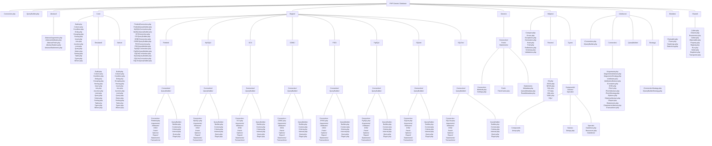

# PHP-Generic-Database

<p align="center">
    
</p>

<p align="center">
    
    
</p>

[![English](https://img.shields.io/badge/English-USA-blue.svg?style=for-the-badge&logo=)](README-en-us.md)

O PHP-Generic-Database é um conjunto de classes PHP desenvolvido para conectar, exibir e manipular genericamente dados de diferentes bancos de dados. Esta biblioteca possibilita centralizar e padronizar os mais variados tipos e comportamentos de cada banco de dados em um único formato, utilizando o padrão Strategy. O projeto foi fortemente inspirado por bibliotecas como [Medoo](https://medoo.in/), [Dibi](https://dibiphp.com/en/) e [PowerLite](https://www.powerlitepdo.com/).

## Bancos de Dados Suportados

O PHP-Generic-Database atualmente suporta os seguintes bancos de dados:


## Principais Características

- **Leve** - Minimalista, simples e fácil de usar, com curva de aprendizado reduzida.
- **Agnóstico** - Pode ser utilizado de diversas formas, suportando métodos encadeáveis, design fluente, argumentos dinâmicos e arrays estáticos.
- **Simples** - Fácil de aprender e usar, com uma construção amigável.
- **Poderoso** - Suporta várias consultas SQL comuns e complexas, mapeamento de dados e previne injeção SQL.
- **Compatível** - Suporta MySQL/MariaDB, SQLSrv/MSSQL, Interbase/Firebird, PgSQL, OCI, SQLite e outros.
- **Escape Automático** - Escapa automaticamente consultas SQL de acordo com o dialeto do driver ou motor SQL utilizado.
- **Amigável** - Funciona bem com qualquer framework PHP, como Laravel, Codeigniter, CakePHP e outros que suportem extensão singleton ou composer.
- **Livre** - Sob a licença MIT, pode ser usado em qualquer lugar, para qualquer finalidade.

## Requisitos

- **PHP >= 8.0**
- **Composer**
- **Extensões Nativas**
  - **MySQL/MariaDB** ***(MySQLi)*** *[php_mysqli.dll/so]*
  - **PostgreSQL** ***(PgSQL)*** *[php_pgsql.dll/so]*
  - **Oracle** ***(OCI8)*** *[php_oci8_***.dll/so]*
  - **SQL Server** ***(sqlsrv)*** *[php_sqlsrv.dll/so]*
  - **Firebird/Interbase** ***(ibase: gds | firebird: fds)*** *[php_interbase.dll/so]*
  - **SQLite** ***(SQLite3)*** *[php_sqlite3.dll/so]*
- **Extensões PDO**
  - **MySQL/MariaDB** ***(MySQL)*** *[php_pdo_mysql.dll/so]*
  - **PostgreSQL** ***(PgSQL)*** *[php_pdo_pgsql.dll/so]*
  - **Oracle** ***(OCI)*** *[php_pdo_oci.dll/so]*
  - **SQL Server** ***(sqlsrv)*** *[php_pdo_sqlsrv.dll/so]*
  - **Firebird/Interbase** ***(ibase: gds | firebird: fds)*** *[php_pdo_firebird.dll/so]*
  - **SQLite** ***(SQLite)*** *[php_pdo_sqlite.dll/so]*
  - **ODBC** ***(ODBC)*** *[php_pdo_obdc.dll/so]*
- **Extensões ODBC**
  - **MySQL/MariaDB** ***(MySQL)*** *[myodbc8a.dll/so]*
  - **PostgreSQL** ***(PgSQL)*** *[psqlodbc30a.dll/so]*
  - **OCI** ***(ORACLE)*** *[sqora32.dll/so]*
  - **SQL Server** ***(sqlsrv)*** *[sqlsrv32.dll/so]*
  - **Firebird/Interbase** ***(ibase: gds | firebird: fds)*** *[odbcFb.dll/so]*
  - **SQLite** ***(SQLite)*** *[sqlite3odbc.dll/so]*
  - **Access** ***(Access)*** *[aceodbc.dll/so]*
  - **Excel** ***(Excel)*** *[aceodexl.dll/so]*
  - **Text** ***(Text)*** *[aceodtxt.dll/so]*
- **Formatos Externos Opcionais**
  - **INI** ***(compilação nativa php)***
  - **XML** ***(ext-libxml, ext-xmlreader, ext-simplexml)***
  - **JSON** ***(compilação nativa php)***
  - **YAML** ***(ext-yaml)***
  - **NEON** ***[(nette/neon)](https://github.com/nette/neon)***

## Instalação Local com XAMPP

1) Certifique-se de que o Git esteja instalado. Caso contrário, instale a partir do [site oficial](https://git-scm.com/downloads).

```bash
git clone https://github.com/nicksonjean/PHP-Generic-Database.git
```

2. Instale o [XAMPP](https://www.apachefriends.org/pt_br/index.html).

### Apenas para Windows

3. Navegue até a pasta `assets/DLL`, selecione a versão do PHP que instalou e extraia o pacote DLL contendo as bibliotecas compiladas para cada motor de banco de dados.  
   3.1. Pacote DLL para [PHP 8.0](./assets/DLL/PHP8.0/PHP8.0.zip).  
   3.2. Pacote DLL para [PHP 8.1](./assets/DLL/PHP8.1/PHP8.1.zip).  
   3.3. Pacote DLL para [PHP 8.2](./assets/DLL/PHP8.2/PHP8.2.zip).  
   3.4. Pacote DLL para [PHP 8.3](./assets/DLL/PHP8.3/PHP8.3.zip).  
4. Copie os arquivos da pasta `DLL` para o diretório `PHP/ext`.
5. Abra o arquivo `php.ini` e remova o comentário das extensões que deseja utilizar, editando o arquivo `php.ini` e removendo o &#039;;&#039; para a extensão de banco de dados que deseja instalar, como mostrado no exemplo abaixo:  

- De:

```ini
;extension=php_pdo_mysql.dll
```

- Para:

```ini
extension=php_pdo_mysql.dll
```

### Apenas para Linux e macOS

3. Faça o download das bibliotecas de terceiros como Oracle e SQLSrv para cada motor de banco de dados e extraia-as para o diretório `PHP/ext`.
4. Compile o código fonte do PHP e instale a extensão PHP que deseja utilizar.
5. Abra o arquivo `php.ini` e remova o comentário das extensões que deseja utilizar, editando o arquivo `php.ini` e removendo o &#039;;&#039; para a extensão de banco de dados que deseja instalar, como mostrado no exemplo abaixo:  

- De:

```ini

```

- Para:

```ini
extension=php_pdo_mysql.so
```

### Para Todos os Sistemas

6. Salve o arquivo e reinicie o servidor PHP ou Apache.
7. Se a extensão for instalada com sucesso, você poderá encontrá-la na saída do phpinfo().
8. Certifique-se de que o Composer esteja instalado. Caso contrário, instale a partir do [site oficial](https://getcomposer.org/download/).
9. Depois que o Composer e o Git estiverem instalados, clone este repositório com o comando abaixo:
10. Em seguida, execute o seguinte comando para instalar todos os pacotes e dependências para este projeto:

```bash
composer install
```

11. [Opcional] Se precisar reinstalar, execute o seguinte comando:

```bash
composer setup
```

## Instalação Local via Docker

1. Certifique-se de que o Docker Desktop esteja instalado. Caso contrário, instale a partir do [site oficial](https://www.docker.com/products/docker-desktop/).
2. Crie uma conta para usar o Docker Desktop/Hub e poder clonar contêineres hospedados na rede Docker.
3. Depois de fazer login no Docker Hub e com o Docker Desktop aberto em seu sistema, execute o comando abaixo:

```bash
docker pull php-generic-database:8.3-full
```

ou

### Apenas para Windows

```bash
.\setup.bat --build-arg PHP_VERSION=8.3 --build-arg PHP_PORT=8300 --run "docker compose up -d"
```

### Apenas para Linux e macOS

```bash
.\setup.sh --build-arg PHP_VERSION=8.3 --build-arg PHP_PORT=8300 --run "docker compose up -d"
```

4. O Docker irá baixar, instalar e configurar uma imagem personalizada Linux tipo Debian como Apache e com PHP 8.x na porta escolhida com todas as extensões devidamente configuradas.

## Documentação

Uma documentação completa da biblioteca está disponível em [Documentação Completa](./docs/index.html).

### Como Usar

Abaixo, há uma série de arquivos README contendo exemplos de como usar a biblioteca e uma imagem de [topologia](./assets/topology.png) dos drivers nativos e PDO.

- Conexão:
  - Strategy:
    - [Chainable.md](./readme/Connection/Strategy/Chainable.md)
    - [Fluent.md](./readme/Connection/Strategy/Fluent.md)
    - [StaticArgs.md](./readme/Connection/Strategy/StaticArgs.md)
    - [StaticArray.md](./readme/Connection/Strategy/StaticArray.md)
  - Módulos:
    - [Chainable.md](./readme/Connection/Modules/Chainable.md)
    - [Fluent.md](./readme/Connection/Modules/Fluent.md)
    - [StaticArgs.md](./readme/Connection/Modules/StaticArgs.md)
    - [StaticArray.md](./readme/Connection/Modules/StaticArray.md)
  - Engines:
    - MySQL/MariaDB com mysqli: [MySQLiConnection.md](./readme/Engines/MySQLiConnection.md)
    - Firebird/Interbase com fbird/ibase: [FirebirdConnection.md](./readme/Engines/FirebirdConnection.md)
    - Oracle com oci8: [OCIConnection.md](./readme/Engines/OCIConnection.md)
    - PostgreSQL com pgsql: [PgSQLConnection.md](./readme/Engines/PgSQLConnection.md)
    - SQL Server com sqlsrv: [SQLSrvConnection.md](./readme/Engines/SQLSrvConnection.md)
    - SQLite com sqlite3: [SQLiteConnection.md](./readme/Engines/SQLiteConnection.md)
    - PDO:
      - [Chainable.md](./readme/Engines/PDOConnection/Chainable.md)
      - [Fluent.md](./readme/Engines/PDOConnection/Fluent.md)
      - [StaticArgs.md](./readme/Engines/PDOConnection/StaticArgs.md)
      - [StaticArray.md](./readme/Engines/PDOConnection/StaticArray.md)
    - ODBC:
      - [Chainable.md](./readme/Engines/ODBCConnection/Chainable.md)
      - [Fluent.md](./readme/Engines/ODBCConnection/Fluent.md)
      - [StaticArgs.md](./readme/Engines/ODBCConnection/StaticArgs.md)
      - [StaticArray.md](./readme/Engines/ODBCConnection/StaticArray.md)
  - Statements: [Statements.md](./readme/Statements.md)
  - Fetches: [Fetches.md](./readme/Fetches.md)
- QueryBuilder:
  - Strategy:
    - [StrategyQueryBuilder.md](./readme/QueryBuilder/StrategyQueryBuilder.md)
  - Engines:
    - MySQL/MariaDB com mysqli: [MySQLiQueryBuilder.md](./readme/Engines/MySQLiQueryBuilder.md)
    - Firebird/Interbase com fbird/ibase: [FirebirdQueryBuilder.md](./readme/Engines/FirebirdQueryBuilder.md)
    - Oracle com oci8: [OCIQueryBuilder.md](./readme/Engines/OCIQueryBuilder.md)
    - PostgreSQL com pgsql: [PgSQLQueryBuilder.md](./readme/Engines/PgSQLQueryBuilder.md)
    - SQL Server com sqlsrv: [SQLSrvQueryBuilder.md](./readme/Engines/SQLSrvQueryBuilder.md)
    - SQLite com sqlite3: [SQLiteQueryBuilder.md](./readme/Engines/SQLiteQueryBuilder.md)
    - PDO: [PDOQueryBuilder.md](./readme/Engines/PDOQueryBuilder.md)
    - ODBC: [ODBCQueryBuilder.md](./readme/Engines/ODBCQueryBuilder.md)

## Estrutura do Projeto

O diagrama de fluxo vertical (de cima para baixo) mostra claramente a organização da estrutura de diretórios do projeto, permitindo uma visualização natural da hierarquia de arquivos e pastas para esta biblioteca de abstração de banco de dados com suporte para múltiplos motores (MySQL, PostgreSQL, SQLite, SQL Server, Firebird, OCI e ODBC), bem como uma estrutura bem definida de classes abstratas, interfaces e helpers.


```mermaid
flowchart TB
    Root["PHP Generic Database"]
    
    Root --- Connection["Connection.php"]
    Root --- QueryBuilder["QueryBuilder.php"]
    Root --- Abstract["Abstract/"]
    Root --- Core["Core/"]
    Root --- Engine["Engine/"]
    Root --- Generic["Generic/"]
    Root --- Helpers["Helpers/"]
    Root --- Interfaces["Interfaces/"]
    Root --- Modules["Modules/"]
    Root --- Shared["Shared/"]
    
    Abstract --- AbstractFiles["
        AbstractArguments.php
        AbstractAttributes.php
        AbstractFetch.php
        AbstractOptions.php
        AbstractStatements.php
    "]
    
    Core --- CoreFiles["
        Build.php
        Column.php
        Condition.php
        Entity.php
        Grouping.php
        Having.php
        Insert.php
        Join.php
        Junction.php
        Limit.php
        Query.php
        Select.php
        Sorting.php
        Table.php
        Types.php
        Where.php
    "]
    Core --- Emulated["Emulated/"]
    Core --- Native["Native/"]
    
    Emulated --- EmulatedFiles["
        Build.php
        Column.php
        Condition.php
        Entity.php
        Grouping.php
        Having.php
        Insert.php
        Join.php
        Junction.php
        Limit.php
        Query.php
        Select.php
        Sorting.php
        Table.php
        Types.php
        Where.php
    "]
    
    Native --- NativeFiles["
        Build.php
        Column.php
        Condition.php
        Entity.php
        Grouping.php
        Having.php
        Insert.php
        Join.php
        Junction.php
        Limit.php
        Query.php
        Select.php
        Sorting.php
        Table.php
        Types.php
        Where.php
    "]
    
    Engine --- EngineFiles["
        FirebirdConnection.php
        FirebirdQueryBuilder.php
        MySQLiConnection.php
        MySQLiQueryBuilder.php
        OCIConnection.php
        OCIQueryBuilder.php
        ODBCConnection.php
        ODBCQueryBuilder.php
        PDOConnection.php
        PDOQueryBuilder.php
        PgSQLConnection.php
        PgSQLQueryBuilder.php
        SQLiteConnection.php
        SQLiteQueryBuilder.php
        SQLSrvConnection.php
        SQLSrvQueryBuilder.php
    "]
    
    Engine --- FirebirdDir["Firebird/"]
    Engine --- MySQLiDir["MySQLi/"]
    Engine --- OCIDir["OCI/"]
    Engine --- ODBCDir["ODBC/"]
    Engine --- PDODir["PDO/"]
    Engine --- PgSQLDir["PgSQL/"]
    Engine --- SQLiteDir["SQLite/"]
    Engine --- SQLSrvDir["SQLSrv/"]
    
    FirebirdDir --- FirebirdSubdir["
        Connection/
        QueryBuilder/
    "]
    
    FirebirdSubdir --- FirebirdConnection["Connection:
        Firebird.php
        Arguments/
        Attributes/
        DSN/
        Fetch/
        Options/
        Report/
        Statements/
        Transactions/
    "]
    
    FirebirdSubdir --- FirebirdBuilder["QueryBuilder:
        Builder.php
        Context.php
        Criteria.php
        Internal.php
        Query.php
        Regex.php
    "]
    
    MySQLiDir --- MySQLiSubdir["
        Connection/
        QueryBuilder/
    "]
    
    MySQLiSubdir --- MySQLiConnection["Connection:
        MySQL.php
        Arguments/
        Attributes/
        DSN/
        Fetch/
        Options/
        Report/
        Statements/
        Transactions/
    "]
    
    MySQLiSubdir --- MySQLiBuilder["QueryBuilder:
        Builder.php
        Context.php
        Criteria.php
        Internal.php
        Query.php
        Regex.php
    "]
    
    OCIDir --- OCISubdir["
        Connection/
        QueryBuilder/
    "]

    OCISubdir --- OCIConnection["Connection:
        OCI.php
        Arguments/
        Attributes/
        DSN/
        Fetch/
        Options/
        Report/
        Statements/
        Transactions/
    "]
    
    OCISubdir --- OCIBuilder["QueryBuilder:
        Builder.php
        Context.php
        Criteria.php
        Internal.php
        Query.php
        Regex.php
    "]
    
    ODBCDir --- ODBCSubdir["
        Connection/
        QueryBuilder/
    "]

    ODBCSubdir --- ODBCConnection["Connection:
        ODBC.php
        Arguments/
        Attributes/
        DSN/
        Fetch/
        Options/
        Report/
        Statements/
        Transactions/
    "]
    
    ODBCSubdir --- ODBCBuilder["QueryBuilder:
        Builder.php
        Context.php
        Criteria.php
        Internal.php
        Query.php
        Regex.php
    "]
    
    PDODir --- PDOSubdir["
        Connection/
        QueryBuilder/
    "]
    
    PDOSubdir --- PDOConnection["Connection:
        XPDO.php
        Arguments/
        Attributes/
        DSN/
        Fetch/
        Options/
        Report/
        Statements/
        Transactions/
    "]
    
    PDOSubdir --- PDOBuilder["QueryBuilder:
        Builder.php
        Context.php
        Criteria.php
        Internal.php
        Query.php
        Regex.php
    "]
    
    PgSQLDir --- PgSQLSubdir["
        Connection/
        QueryBuilder/
    "]

    PgSQLSubdir --- PgSQLConnection["Connection:
        PgSQL.php
        Arguments/
        Attributes/
        DSN/
        Fetch/
        Options/
        Report/
        Statements/
        Transactions/
    "]
    
    PgSQLSubdir --- PgSQLBuilder["QueryBuilder:
        Builder.php
        Context.php
        Criteria.php
        Internal.php
        Query.php
        Regex.php
    "]
    
    SQLiteDir --- SQLiteSubdir["
        Connection/
        QueryBuilder/
    "]

    SQLiteSubdir --- SQLiteConnection["Connection:
        SQLite.php
        Arguments/
        Attributes/
        DSN/
        Fetch/
        Options/
        Report/
        Statements/
        Transactions/
    "]
    
    SQLiteSubdir --- SQLiteBuilder["QueryBuilder:
        Builder.php
        Context.php
        Criteria.php
        Internal.php
        Query.php
        Regex.php
    "]
    
    SQLSrvDir --- SQLSrvSubdir["
        Connection/
        QueryBuilder/
    "]
    
    SQLSrvSubdir --- SQLSrvConnection["Connection:
        SQLSrv.php
        Arguments/
        Attributes/
        DSN/
        Fetch/
        Options/
        Report/
        Statements/
        Transactions/
    "]
    
    SQLSrvSubdir --- SQLSrvBuilder["QueryBuilder:
        Builder.php
        Context.php
        Criteria.php
        Internal.php
        Query.php
        Regex.php
    "]
    
    Generic --- GenericDir["
        Connection/
        Fetch/
        Statements/
    "]
    
    GenericDir --- GenericConnection["Connection:
        Methods.php
        Settings.php
    "]
    
    GenericDir --- GenericFetch["Fetch:
        FetchCache.php
    "]
    
    GenericDir --- GenericStatements["Statements:
        Metadata.php
        QueryMetadata.php
        RowsMetadata.php
    "]
    
    Helpers --- HelpersFiles["
        Compare.php
        Errors.php
        Exceptions.php
        Generators.php
        Hash.php
        Path.php
        Reflections.php
        Schemas.php
        Validations.php
    "]
    
    Helpers --- ParsersDir["Parsers/"]
    Helpers --- TypesDir["Types/"]
    
    ParsersDir --- ParsersFiles["
        INI.php
        JSON.php
        NEON.php
        SQL.php
        TXT.php
        XML.php
        YAML.php
        SQL/
    "]
    
    TypesDir --- TypesSubdirs["
        Compounds/
        Scalars/
        Specials/
    "]
    
    TypesSubdirs --- CompoundsDir["Compounds:
        Arrays.php
    "]
    
    TypesSubdirs --- ScalarsDir["Scalars:
        Strings.php
    "]
    
    TypesSubdirs --- SpecialsDir["Specials:
        Datetimes.php
        Resources.php
        Datetimes/
    "]
    
    Interfaces --- InterfacesFiles["
        IConnection.php
        IQueryBuilder.php
    "]
    
    Interfaces --- ConnectionInterfaces["Connection/"]
    Interfaces --- QueryBuilderInterfaces["QueryBuilder/"]
    Interfaces --- StrategyInterfaces["Strategy/"]
    
    ConnectionInterfaces --- ConnInterfaceFiles["
        IArguments.php
        IArgumentsAbstract.php
        IArgumentsStrategy.php
        IAttributes.php
        IAttributesAbstract.php
        IConstants.php
        IDSN.php
        IFetch.php
        IFetchAbstract.php
        IFetchStrategy.php
        IOptions.php
        IOptionsAbstract.php
        IReport.php
        IStatements.php
        IStatementsAbstract.php
        ITransactions.php
    "]
    
    StrategyInterfaces --- StrategyInterfaceFiles["
        IConnectionStrategy.php
        IQueryBuilderStrategy.php
    "]
    
    Modules --- ModulesFiles["
        Chainable.php
        Fluent.php
        StaticArgs.php
        StaticArray.php
    "]
    
    Shared --- SharedFiles["
        Caller.php
        Cleaner.php
        Enumerator.php
        Getter.php
        Objectable.php
        Property.php
        Registry.php
        Run.php
        Setter.php
        Singleton.php
        Transporter.php
    "]
```

## Exemplos de Uso

Para iniciar rapidamente, aqui estão alguns exemplos básicos de como usar a biblioteca:

### Exemplo 1: Executando um FetchAll em Consulta Simples a um Banco de Dados MySQL

```php
use GenericDatabase\Connection;

$context = Connection::setEngine('mysqli')
                ::setHost('localhost')
                ::setPort(3306)
                ::setDatabase('demodev')
                ::setUser('root')
                ::setPassword('masterkey')
                ::setCharset('utf8')
                ->connect();

$results = $context->query('SELECT id AS Codigo, nome AS Estado, sigla AS Sigla FROM estado WHERE id >= 25');

var_dump($results->fetchAll());
```

### Exemplo 2: Utilizando o QueryBuilder

```php
use GenericDatabase\QueryBuilder;

$context = Connection::setEngine('mysqli')
                ::setHost('localhost')
                ::setPort(3306)
                ::setDatabase('demodev')
                ::setUser('root')
                ::setPassword('masterkey')
                ::setCharset('utf8')
                ->connect();

$results = (new QueryBuilder($context))::select(['e.id AS Codigo', 'e.nome AS Estado', 'e.sigla AS Sigla'])
    ->from(['estado e'])
    ->where(['e.id >= 25']);

var_dump($results->fetchAll());
```

### Exemplo 3: Transações com PDO

```php
use GenericDatabase\Connection;

$context = Connection::setEngine('pdo')
                ::setHost('localhost')
                ::setPort(3306)
                ::setDatabase('demodev')
                ::setUser('root')
                ::setPassword('masterkey')
                ::setCharset('utf8')
                ->connect();

try {
    $context->beginTransaction();

    $b = $context->prepare('INSERT INTO estado (nome, sigla) VALUES (:nome, :sigla)', [[':nome' => 'TESTE', ':sigla' => 'T1'], [':nome' => 'TESTE', ':sigla' => 'T2'], [':nome' => 'TESTE', ':sigla' => 'T5']]);
    var_dump($b->getAllMetadata());

    var_dump($b->lastInsertId('estado'));

    $c = $context->prepare('UPDATE estado SET sigla = :sigla WHERE nome = :nome', [':sigla' => 'T3', ':nome' => 'TESTE']);
    var_dump($c->getAllMetadata());

    $d = $context->query("UPDATE estado SET sigla = 'T4' WHERE nome = 'TESTE'");
    var_dump($d->getAllMetadata());

    $f = $context->query("DELETE FROM estado WHERE nome IN ('TESTE')");
    var_dump($f->getAllMetadata());

    $context->commit();

    var_dump("Transação completada com sucesso!");
} catch (Exception $e) {

    $context->rollback();
    var_dump("Erro na transação: " . $e->getMessage());
}
```

## Contribuindo

Contribuições são bem-vindas! Se você deseja contribuir com o projeto, siga estes passos:

1. Faça um fork do repositório
2. Crie um branch para sua feature (`git checkout -b feature/nova-funcionalidade`)
3. Faça commit das suas alterações (`git commit -m 'Adiciona nova funcionalidade'`)
4. Faça push para o branch (`git push origin feature/nova-funcionalidade`)
5. Abra um Pull Request

## Licença

O PHP-Generic-Database é liberado sob a licença MIT. Veja o arquivo [LICENSE](./LICENSE) para mais detalhes.